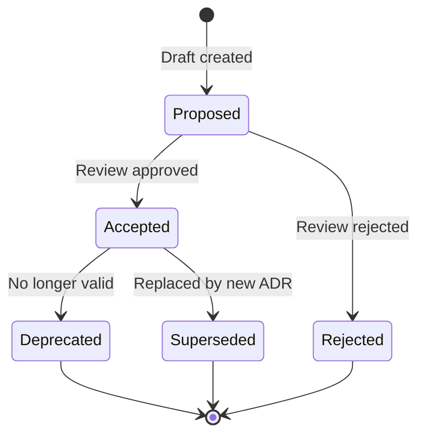

# Architecture Decision Records (ADR) Template & Index

---

## Purpose

This document serves as:
1. An **index** of all architecture decision records for the platform
2. A **template** for creating new ADRs

---

## ADR Index

| ADR ID | Title | Status | Date | Impact |
|--------|-------|--------|------|--------|
| [ADR-001](ADR-001-schema-registry-strategy.md) | Schema Registry and Compatibility Enforcement Strategy | ✅ Accepted | 2026-01-12 | High |
| ADR-002 | Schema Versioning Strategy | 📝 Proposed | TBD | High |
| ADR-003 | RDF Store Selection | 📝 Proposed | TBD | High |
| ADR-004 | Authentication & Authorization Strategy | 📝 Proposed | TBD | High |
| ADR-005 | Event-Driven Architecture | 📝 Proposed | TBD | Medium |
| ADR-006 | API Versioning Strategy | 📝 Proposed | TBD | Medium |
| ADR-007 | Caching Strategy | 📝 Proposed | TBD | Medium |
| ADR-008 | Multi-Tenancy Approach | 📝 Proposed | TBD | Medium |

---

## Pending Decision Topics

The following architectural decisions need to be documented:

### High Priority

1. **Schema Versioning Strategy**
   - How are version numbers assigned? (SemVer, sequential, date-based)
   - What constitutes major/minor/patch changes?
   - How are breaking changes communicated?

2. **RDF Store Selection**
   - Which RDF database? (Amazon Neptune, GraphDB, Stardog, Jena Fuseki)
   - Cloud-managed vs self-hosted?
   - High availability requirements?

3. **Authentication & Authorization Strategy**
   - Which identity provider?
   - RBAC vs ABAC vs hybrid?
   - How are domain-scoped permissions modeled?

### Medium Priority

4. **Event-Driven Architecture**
   - EventBridge vs SNS/SQS vs Kafka?
   - Event schema standards (CloudEvents)?
   - Event sourcing for audit trail?

5. **API Versioning Strategy**
   - URL path vs header vs query parameter?
   - Deprecation policy?
   - Backward compatibility guarantees?

6. **Caching Strategy**
   - What is cached? (Schema content, query results, UI state)
   - Cache invalidation approach?
   - Distributed cache (ElastiCache) vs local?

7. **Multi-Tenancy Approach**
   - Domain isolation model?
   - Shared vs dedicated resources?
   - Cross-domain access patterns?

### Lower Priority

8. **Frontend State Management**
   - Angular Signals vs NgRx vs Akita?
   - Undo/redo implementation?

9. **Infrastructure as Code**
   - Terraform vs AWS CDK?
   - Module organization?

10. **Observability Stack**
    - CloudWatch vs third-party (Datadog, New Relic)?
    - Custom metrics strategy?

---

## ADR Template

Use this template when creating a new ADR:

```markdown
# ADR-XXX: [Title]

## Status
[Proposed | Accepted | Deprecated | Superseded by ADR-XXX]

## Date
[YYYY-MM-DD]

---

## Context

[Describe the issue that motivates this decision. What is the problem we're trying to solve? What constraints exist?]

---

## Decision

[Describe the decision that was made. Be specific about what is being adopted or rejected.]

---

## Alternatives Considered

### Alternative 1: [Name]
**[Accepted/Rejected]**
- [Pros and cons]
- [Why was it accepted or rejected?]

### Alternative 2: [Name]
**[Accepted/Rejected]**
- [Pros and cons]
- [Why was it accepted or rejected?]

---

## Rationale

[Explain why this decision was made. What factors were most important? What trade-offs were accepted?]

---

## Consequences

### Positive
- [List positive outcomes]

### Negative
- [List negative outcomes or trade-offs]

### Neutral
- [List neutral impacts]

---

## Implementation Notes

[Any specific guidance for implementing this decision]

---

## Related Documents

- [Links to related ADRs, design docs, or external resources]

---

## Review History

| Date | Reviewer | Outcome |
|------|----------|---------|
| [Date] | [Name] | [Approved/Requested changes] |
```

---

## ADR Process

### Creating a New ADR

1. Copy the template above
2. Assign the next sequential ADR number
3. Fill in all sections
4. Submit for architecture review
5. Update status when accepted

### ADR Lifecycle



### Review Criteria

An ADR should be accepted when:
- [ ] Problem statement is clear
- [ ] Alternatives were genuinely considered
- [ ] Rationale explains the trade-offs
- [ ] Consequences are honestly assessed
- [ ] Implementation path is feasible
- [ ] Stakeholders have been consulted

---

## Suggested ADRs for Immediate Creation

Based on the current state of documentation, these ADRs would add the most value:

### ADR-002: Schema Versioning Strategy (Draft)

**Context**: The platform needs a consistent approach to versioning schemas.

**Key Questions**:
- Is SemVer appropriate for schemas?
- How do we handle breaking changes in governed schemas when Collibra metadata changes?
- Should authored and governed schemas follow the same versioning rules?

**Likely Decision**: SemVer with automated version bumping based on compatibility analysis.

---

### ADR-003: RDF Store Selection (Draft)

**Context**: System A requires an RDF store for semantic modeling.

**Key Questions**:
- Managed service (Neptune) vs self-hosted?
- Query performance requirements?
- HA/DR requirements?

**Options**:
- Amazon Neptune (managed, AWS-native)
- GraphDB (powerful, requires management)
- Apache Jena Fuseki (open source, self-hosted)

**Likely Decision**: Amazon Neptune for AWS alignment and managed operations.

---

### ADR-004: Authentication & Authorization Strategy (Draft)

**Context**: The platform requires enterprise-grade auth with domain-scoped permissions.

**Key Questions**:
- How to integrate with enterprise IdP?
- RBAC vs ABAC for domain scoping?
- Service-to-service authentication?

**Options**:
- Cognito + custom authorizer
- Direct OIDC integration
- API Gateway + IAM

**Likely Decision**: OIDC integration with ABAC for domain scoping.

---

## Related Documents

- [System Integration Architecture](System-Integration-Architecture.md)
- [Risk & Compliance Appendix](json-schema-platform-risk-compliance-appendix.md)
- [ADR-001: Schema Registry Strategy](ADR-001-schema-registry-strategy.md)
