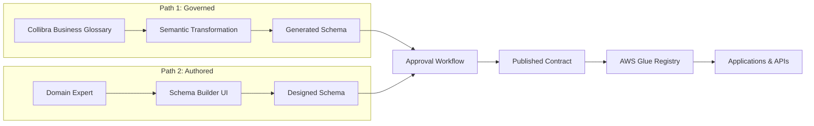

# Executive Overview
## JSON Schema Platform: Model-Driven Data Contracts
### For VP & Senior Director Audience

---

## 1. The Business Problem

### 1.1 What's at Stake

Modern enterprises exchange data across hundreds of systems, APIs, and applications. Without governed **data contracts**, organizations face:

| Problem | Business Impact |
|---------|-----------------|
| **Breaking changes** | Production outages, customer impact, emergency fixes |
| **Schema sprawl** | Duplicate definitions, inconsistent data, integration failures |
| **Governance gaps** | Audit findings, compliance risk, regulatory exposure |
| **Slow delivery** | Manual coordination, approval bottlenecks, delayed releases |
| **Knowledge silos** | Tribal knowledge, onboarding delays, key-person dependencies |

**The cost of ungoverned data contracts**: Engineering rework, production incidents, compliance remediation, and delayed time-to-market.

### 1.2 The Opportunity

A **model-driven schema platform** transforms data contract management from a manual, error-prone process into an automated, governed capability that:

- ✅ **Prevents breaking changes** before they reach production
- ✅ **Connects schemas to business definitions** for traceability
- ✅ **Enables self-service** for domain teams
- ✅ **Enforces governance** without creating bottlenecks

---

## 2. Solution Overview

### 2.1 Two Complementary Capabilities

```
┌─────────────────────────────────────────────────────────────────────┐
│                   JSON Schema Platform                               │
├────────────────────────────┬────────────────────────────────────────┤
│  GOVERNED SCHEMAS          │  AUTHORED SCHEMAS                      │
│  (Automated from Collibra) │  (Created by Domain Teams)             │
├────────────────────────────┼────────────────────────────────────────┤
│  • Semantic data model     │  • Guided UI for non-experts           │
│  • Business glossary link  │  • Approval workflows                  │
│  • Automatic generation    │  • Reusable type library               │
│  • Full lineage            │  • Real-time validation                │
├────────────────────────────┴────────────────────────────────────────┤
│              UNIFIED GOVERNANCE & ENFORCEMENT                        │
│  • Compatibility validation  • Version control  • Audit trail       │
└─────────────────────────────────────────────────────────────────────┘
```

### 2.2 Key Capabilities

| Capability | What It Does | Business Benefit |
|------------|--------------|------------------|
| **Guided Schema Builder** | Non-experts create valid schemas through UI | Democratizes schema creation, reduces specialist bottlenecks |
| **Semantic Generation** | Schemas auto-generated from Collibra definitions | Guarantees alignment with governed business terms |
| **Compatibility Enforcement** | Prevents breaking changes at publish time | Eliminates production incidents from contract violations |
| **Approval Workflows** | Structured review and approval process | Governance without manual tracking |
| **Complete Lineage** | Every field traceable to business definition | Audit-ready, regulatory compliance |
| **Consumer Self-Service** | API catalog for developers to discover schemas | Faster integration, reduced support requests |

---

## 3. How It Works

### 3.1 The Two Paths to a Published Schema



**Path 1 (Governed)**: For enterprise entities like Customer, Product, Account—definitions already governed in Collibra are automatically transformed into schemas. Changes in Collibra flow through to updated contracts.

**Path 2 (Authored)**: For event schemas, API-specific contracts, or new entities—domain experts design schemas through a guided UI without needing JSON expertise.

**Both paths converge** through the same approval workflow and compatibility enforcement.

### 3.2 What "Model-Driven" Means

Traditional Approach:
```
Developer writes JSON → Hope it matches requirements → Manual review → Deploy → Discover issues in production
```

Model-Driven Approach:
```
Business defines terms → Model generates schema → Validation enforced → Compatibility guaranteed → Safe deployment
```

**The model (business definitions) drives the schema**, not the other way around.

---

## 4. Value Proposition

### 4.1 Quantified Benefits

| Metric | Before | After | Improvement |
|--------|--------|-------|-------------|
| Time to create schema | 2-4 hours | 15-30 minutes | **75-85% faster** |
| Breaking change incidents | 5-10/quarter | Near zero | **>95% reduction** |
| Schema review time | 1-2 days | 1-2 hours | **90% faster** |
| Audit evidence gathering | 2-3 days | < 1 hour | **95% faster** |
| Developer onboarding (contracts) | 1 week | 1 day | **80% faster** |

### 4.2 Risk Reduction

| Risk | Without Platform | With Platform |
|------|------------------|---------------|
| **Production outage from breaking change** | High likelihood | Prevented by design |
| **Compliance finding (change control)** | Possible | Enforced controls, audit trail |
| **Data quality issues from schema mismatch** | Frequent | Validation at source |
| **Key-person dependency** | Critical risk | Self-service, documented |

### 4.3 Strategic Value

```
┌─────────────────────────────────────────────────────────────────┐
│                    STRATEGIC BENEFITS                            │
├─────────────────────────────────────────────────────────────────┤
│                                                                  │
│   Data Governance ────────────► Data Contracts ────────────►    │
│   (Collibra)                    (Schema Platform)               │
│                                        │                         │
│                                        ▼                         │
│                              Applications & APIs                 │
│                                        │                         │
│                                        ▼                         │
│                              Consistent, Trusted Data            │
│                                                                  │
├─────────────────────────────────────────────────────────────────┤
│  • Governance investments flow to technical enforcement         │
│  • Single source of truth from definition to consumption        │
│  • Platform capability, not project deliverable                 │
└─────────────────────────────────────────────────────────────────┘
```

---

## 5. Governance & Compliance

### 5.1 Built-In Controls

| Control | Implementation | Evidence |
|---------|----------------|----------|
| **Change Management** | Approval workflow required before publication | Approval records with timestamps |
| **Segregation of Duties** | Authors cannot approve their own changes | System-enforced, auditable |
| **Compatibility Rules** | Breaking changes rejected at publish boundary | Automated validation logs |
| **Audit Trail** | Every action logged with actor and timestamp | Exportable audit reports |
| **Lineage** | Every field linked to source definition | Traceable to Collibra asset |

### 5.2 Compliance Readiness

- **SOX**: Change control evidence, approval records
- **Internal Audit**: Self-service reporting, complete history
- **Data Governance**: Enforced alignment with business glossary
- **GDPR/Privacy**: Clear documentation of data structures

---

## 6. Technology Foundation

### 6.1 Architecture Highlights

| Component | Technology | Why |
|-----------|------------|-----|
| **Schema Registry** | AWS Glue | Enterprise-grade, compatibility enforcement built-in |
| **Semantic Model** | RDF/OWL | Industry standard for data semantics |
| **Governance Source** | Collibra | Enterprise data governance platform |
| **User Interface** | Angular | Modern, responsive, accessible |
| **Workflow** | AWS Step Functions | Reliable, auditable state management |

### 6.2 Enterprise Alignment

- ✅ **AWS-native**: Aligns with cloud strategy
- ✅ **Standard formats**: JSON Schema (Draft 2020-12), OpenAPI compatible
- ✅ **Integration-ready**: REST APIs, event notifications
- ✅ **Security**: IAM integration, encryption at rest and in transit

---

## 7. User Experience

### 7.1 For Domain Teams (Schema Authors)

**Before**: "I need to write JSON Schema but I don't know the syntax. I'll ask an engineer..."

**After**: A guided experience:

```
┌─────────────────────────────────────────────────────────────────┐
│  Schema Builder                                    [Save] [Propose]│
├───────────────┬─────────────────────────────────────────────────┤
│               │                                                  │
│  📁 Order     │  Field: orderId                                 │
│    ├─ orderId │  ─────────────────                              │
│    ├─ items[] │  Type: [String ▼]                               │
│    │  └─ ...  │  Required: [✓]                                  │
│    └─ total   │  Min Length: [1]                                │
│               │  Description: [Unique order identifier]         │
│  📚 Types     │                                                  │
│    └─ LineItem│  [✓] Valid                                      │
│               │                                                  │
└───────────────┴─────────────────────────────────────────────────┘
```

- No JSON syntax knowledge required
- Real-time validation feedback
- Reusable types for consistency

### 7.2 For Developers (Schema Consumers)

**Before**: "Where's the latest schema? Is this version still supported?"

**After**: Self-service catalog:
- Search and discover schemas
- Download or fetch via API
- Subscribe to change notifications
- Clear version and compatibility information

### 7.3 For Governance (Reviewers & Stewards)

**Before**: "I need to manually compare this change and track approval in email..."

**After**: Streamlined workflow:
- Visual diff of changes
- Compatibility pre-checked
- One-click approve/reject
- Full audit trail

---

## 8. Implementation Approach

### 8.1 Phased Rollout

| Phase | Scope | Duration | Outcome |
|-------|-------|----------|---------|
| **Phase 1** | Core platform + 2 pilot domains | 3 months | Validated capability |
| **Phase 2** | Collibra integration + 5 domains | 3 months | Governance connection |
| **Phase 3** | Enterprise rollout | 6 months | Full adoption |

### 8.2 Success Criteria

| Phase | Success Metric |
|-------|----------------|
| Phase 1 | 10+ schemas published, 0 breaking changes |
| Phase 2 | 50+ governed schemas, audit evidence generated |
| Phase 3 | 200+ schemas, self-service adoption > 80% |

---

## 9. Investment & ROI

### 9.1 Resource Requirements

| Category | Investment |
|----------|------------|
| Platform development | [X] engineering months |
| AWS infrastructure | [Y] monthly (scales with usage) |
| Change management | Training, documentation, support |

### 9.2 Return on Investment

| Benefit Category | Annual Value |
|------------------|--------------|
| Avoided production incidents | $XXX,XXX (incident cost × reduction) |
| Engineering time savings | $XXX,XXX (hours saved × rate) |
| Audit preparation reduction | $XX,XXX (audit hours × rate) |
| Faster delivery (opportunity) | Qualitative—faster time to market |

**Payback period**: [X] months

---

## 10. Risks & Mitigations

| Risk | Impact | Mitigation |
|------|--------|------------|
| Adoption resistance | Medium | Phased rollout, champion program, clear value demonstration |
| Integration complexity | Medium | Proven AWS services, incremental integration |
| Scope creep | Medium | Clear MVP definition, phased approach |
| Collibra dependency | Low | Works standalone; Collibra integration is additive |

---

## 11. Competitive Advantage

### What Makes This Different

| Alternative | Limitation | Our Advantage |
|-------------|------------|---------------|
| Manual JSON Schema | Error-prone, no governance | Guided, governed, validated |
| Generic schema tools | No business alignment | Connected to Collibra definitions |
| Custom validation | Point solutions, no lifecycle | Full lifecycle management |
| Spreadsheet tracking | No enforcement | Automated compatibility checks |

### Strategic Positioning

This platform transforms **data governance investments** (Collibra definitions) into **operational enforcement** (API contracts), closing the gap between policy and execution.

---

## 12. Summary

### The Problem
Data contract management is manual, error-prone, and disconnected from business governance.

### The Solution
A model-driven schema platform that:
- **Generates schemas** from governed business definitions
- **Guides non-experts** through schema creation
- **Enforces compatibility** before production deployment
- **Provides complete audit trail** for compliance

### The Value
- 75%+ reduction in schema creation time
- Near-zero breaking change incidents
- Audit-ready governance evidence
- Self-service for domain teams

### The Ask
[Approval to proceed with Phase 1 / funding / resources]

---

## Appendix: Demo Script

### 5-Minute Executive Demo

1. **Show the problem** (30 sec): Raw JSON Schema—complex, error-prone
2. **Show the builder** (2 min): Create a simple schema through the UI
3. **Show compatibility** (1 min): Attempt a breaking change, see rejection
4. **Show lineage** (1 min): Click through from schema field to Collibra definition
5. **Show audit** (30 sec): Export change history

### Key Talking Points

- "Non-experts can create valid schemas without writing JSON"
- "Breaking changes are prevented before they reach production"
- "Every field traces back to your governed business definitions"
- "Audit evidence is generated automatically, not assembled manually"

---

## Related Documents

For deeper technical detail:
- [System Integration Architecture](System-Integration-Architecture.md)
- [User Journey Documentation](User-Journey-Documentation.md)
- [Risk & Compliance Appendix](json-schema-platform-risk-compliance-appendix.md)
