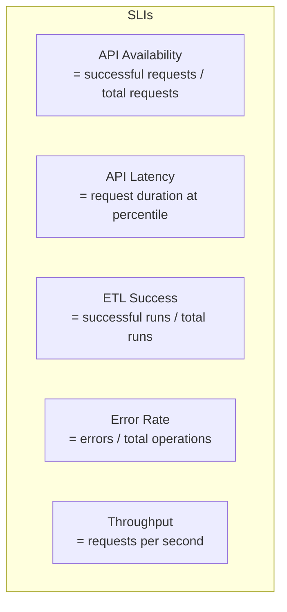
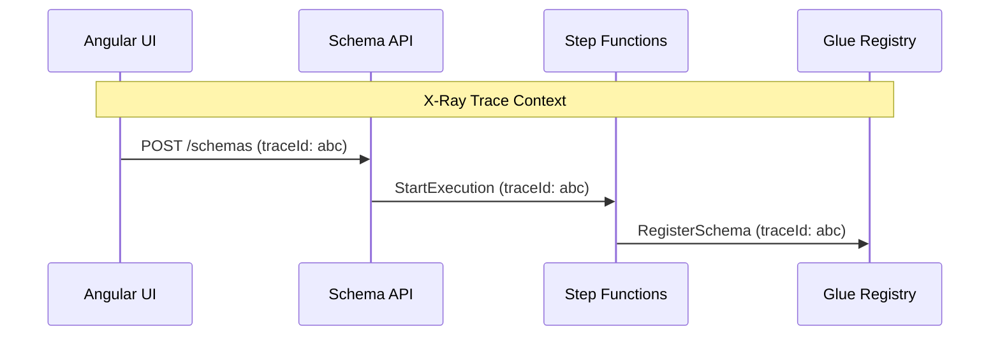
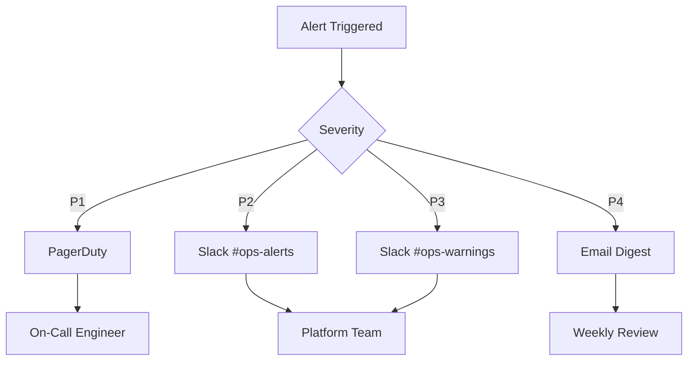

# Operations & Observability Guide
## JSON Schema & Semantic Data Platform

---

## 1. Purpose

This document defines the operational requirements, observability design, and runbook procedures for maintaining the JSON Schema & Semantic Data Platform in production. It covers monitoring, alerting, incident response, and day-to-day operational tasks.

---

## 2. Operational Objectives

### 2.1 Service Level Objectives (SLOs)

| Service | Metric | Target | Measurement Window |
|---------|--------|--------|-------------------|
| Schema Management API | Availability | 99.9% | Monthly |
| Schema Management API | Latency (p95) | < 500ms | Daily |
| Schema Management API | Latency (p99) | < 1000ms | Daily |
| Schema Factory API | Availability | 99.5% | Monthly |
| Schema Factory API | Latency (p95) | < 2000ms | Daily |
| ETL Pipeline | Success Rate | 99% | Weekly |
| ETL Pipeline | Completion Time | < 2 hours | Per run |
| Publish Operations | Success Rate | 99.9% | Monthly |
| Approval Workflow | Response Time | < 24 hours | Monthly |

### 2.2 Service Level Indicators (SLIs)



---

## 3. Observability Design

### 3.1 Observability Pillars

```
┌─────────────────────────────────────────────────────────────┐
│                    Observability Stack                       │
├───────────────┬───────────────┬───────────────┬─────────────┤
│    Metrics    │     Logs      │    Traces     │   Events    │
├───────────────┼───────────────┼───────────────┼─────────────┤
│ CloudWatch    │ CloudWatch    │ X-Ray         │ EventBridge │
│ Metrics       │ Logs          │               │             │
├───────────────┼───────────────┼───────────────┼─────────────┤
│ Dashboards    │ Log Insights  │ Service Map   │ Event Log   │
│ Alarms        │ Alerts        │ Trace View    │ Audit Trail │
└───────────────┴───────────────┴───────────────┴─────────────┘
```

### 3.2 Metrics Inventory

#### 3.2.1 System A: Semantic Transformation Pipeline

| Metric Name | Type | Unit | Description |
|-------------|------|------|-------------|
| `etl.run.duration` | Histogram | seconds | ETL pipeline execution time |
| `etl.run.status` | Counter | count | Runs by status (success/failure) |
| `etl.entities.processed` | Gauge | count | Entities processed per run |
| `etl.triples.materialized` | Gauge | count | RDF triples created |
| `etl.errors.count` | Counter | count | Errors during materialization |
| `factory.schema.generated` | Counter | count | Schemas generated |
| `factory.query.duration` | Histogram | ms | SPARQL query execution time |
| `factory.cache.hit_rate` | Gauge | percent | Schema cache effectiveness |
| `rdf.store.query.duration` | Histogram | ms | RDF store query latency |
| `rdf.store.size` | Gauge | triples | Total triples in store |

#### 3.2.2 System B: Schema Management Platform

| Metric Name | Type | Unit | Description |
|-------------|------|------|-------------|
| `api.request.count` | Counter | count | Total API requests |
| `api.request.duration` | Histogram | ms | Request latency |
| `api.request.errors` | Counter | count | 4xx and 5xx responses |
| `schema.draft.created` | Counter | count | Draft versions created |
| `schema.proposed` | Counter | count | Versions proposed |
| `schema.published` | Counter | count | Versions published |
| `schema.rejected` | Counter | count | Versions rejected |
| `workflow.active` | Gauge | count | Active approval workflows |
| `workflow.duration` | Histogram | hours | Time from propose to resolution |
| `glue.registration.success` | Counter | count | Successful Glue registrations |
| `glue.registration.failure` | Counter | count | Failed Glue registrations |
| `glue.compatibility.failure` | Counter | count | Compatibility rejections |

#### 3.2.3 Angular UI Metrics

| Metric Name | Type | Unit | Description |
|-------------|------|------|-------------|
| `ui.page.load_time` | Histogram | ms | Page load performance |
| `ui.schema.save.duration` | Histogram | ms | Save operation latency |
| `ui.validation.errors` | Counter | count | Client-side validation failures |
| `ui.errors.js` | Counter | count | JavaScript errors |

### 3.3 Logging Standards

#### 3.3.1 Structured Log Format

```json
{
  "timestamp": "2026-01-13T10:30:00.000Z",
  "level": "INFO|WARN|ERROR",
  "service": "schema-management-api",
  "traceId": "abc123",
  "spanId": "def456",
  "correlationId": "user-request-789",
  "message": "Schema published successfully",
  "context": {
    "subject": "gov.customer.Customer",
    "version": "1.2.0",
    "source": "collibra_etl",
    "userId": "user@example.com",
    "duration_ms": 234
  }
}
```

#### 3.3.2 Log Levels

| Level | Usage | Examples |
|-------|-------|----------|
| **ERROR** | Failures requiring attention | Glue registration failure, ETL crash |
| **WARN** | Degraded but functional | Cache miss, retry succeeded |
| **INFO** | Business events | Schema published, ETL completed |
| **DEBUG** | Troubleshooting detail | Query executed, state transition |
| **TRACE** | Verbose debugging | Full request/response bodies |

#### 3.3.3 Sensitive Data Handling

**NEVER LOG**:
- Schema content (may contain sensitive examples)
- User credentials or tokens
- Full Collibra exports
- PII from metadata

**ALWAYS LOG**:
- Operation type and status
- Subject/version identifiers
- User identity (actor)
- Duration and timestamps
- Error codes and categories (not full stack traces in prod)

### 3.4 Distributed Tracing

#### 3.4.1 Trace Context Propagation



#### 3.4.2 Key Trace Points

| Service | Instrumented Operations |
|---------|------------------------|
| API Gateway | Request entry, auth |
| Lambda/ECS | Handler execution |
| DynamoDB | Read/write operations |
| Step Functions | State transitions |
| Glue | Registration calls |
| RDF Store | SPARQL queries |

### 3.5 Event Streaming

#### 3.5.1 Domain Events Published

| Event | Trigger | Subscribers |
|-------|---------|-------------|
| `SchemaCreated` | New subject created | Audit, notifications |
| `SchemaProposed` | Version proposed | Reviewer notifications |
| `SchemaApproved` | Version approved | Audit, next workflow step |
| `SchemaPublished` | Version published to Glue | Consumer notifications, audit |
| `SchemaRejected` | Compatibility/approval failure | Author notification, audit |
| `SchemaDeprecated` | Version deprecated | Consumer warnings, audit |
| `ETLCompleted` | Materialization finished | Schema factory trigger |
| `ETLFailed` | Materialization error | Alerting, audit |

#### 3.5.2 Event Schema Example

```json
{
  "eventType": "SchemaPublished",
  "eventTime": "2026-01-13T10:30:00Z",
  "source": "schema-management-platform",
  "subject": "gov.customer.Customer",
  "version": "1.2.0",
  "payload": {
    "glueVersionId": "glue-123",
    "publishedBy": "workflow-system",
    "source": "collibra_etl",
    "compatibilityMode": "BACKWARD"
  }
}
```

---

## 4. Alerting Strategy

### 4.1 Alert Severity Levels

| Severity | Response Time | Examples | Notification |
|----------|---------------|----------|--------------|
| **P1 - Critical** | 15 minutes | API down, data loss risk | PagerDuty, SMS |
| **P2 - High** | 1 hour | Degraded performance, ETL failure | Slack, email |
| **P3 - Medium** | 4 hours | Elevated error rate, queue backup | Slack |
| **P4 - Low** | Next business day | Warnings, capacity trending | Email digest |

### 4.2 Alert Definitions

#### 4.2.1 Critical Alerts (P1)

| Alert | Condition | Action |
|-------|-----------|--------|
| `API_Unavailable` | Availability < 95% for 5 min | Page on-call, check all dependencies |
| `Glue_Registration_Failure` | 5 consecutive failures | Page on-call, check Glue service health |
| `Data_Loss_Risk` | DynamoDB errors + failed backups | Page on-call, verify data integrity |
| `Security_Breach_Detected` | Unauthorized access pattern | Page security team, initiate IR |

#### 4.2.2 High Alerts (P2)

| Alert | Condition | Action |
|-------|-----------|--------|
| `API_Latency_High` | p95 > 2000ms for 15 min | Investigate, scale if needed |
| `ETL_Pipeline_Failed` | Run failed | Check logs, retry or escalate |
| `Approval_Queue_Stalled` | > 50 pending > 24h | Notify reviewers, check workflow |
| `Error_Rate_Elevated` | > 5% errors for 10 min | Investigate recent deployments |

#### 4.2.3 Medium Alerts (P3)

| Alert | Condition | Action |
|-------|-----------|--------|
| `Cache_Hit_Rate_Low` | < 70% for 1 hour | Investigate cache configuration |
| `DynamoDB_Throttling` | Throttled requests > 0 | Review capacity, consider scaling |
| `Schema_Rejection_Spike` | > 10 rejections in 1 hour | Check for systematic issues |

### 4.3 Alert Routing



---

## 5. Dashboards

### 5.1 Executive Dashboard

**Purpose**: High-level health for leadership

**Widgets**:
- Overall system availability (last 30 days)
- Schema publication rate trend
- Active users / consumers
- Error budget consumption
- Key SLO status

### 5.2 Operations Dashboard

**Purpose**: Day-to-day monitoring for platform team

**Widgets**:
- API request rate and latency
- Error rate by endpoint
- ETL pipeline status
- Active workflows count
- Glue registration status
- Infrastructure health (Lambda, DynamoDB, etc.)

### 5.3 ETL Pipeline Dashboard

**Purpose**: Data engineering monitoring

**Widgets**:
- Pipeline run history (success/failure)
- Run duration trends
- Entities processed per run
- Triples materialized
- Error breakdown by type
- RDF store metrics

### 5.4 Consumer Dashboard

**Purpose**: API consumer experience

**Widgets**:
- Schema fetch latency
- Most accessed schemas
- Error rates by consumer
- Version distribution (latest vs old)
- Deprecated schema usage warnings

---

## 6. Runbooks

### 6.1 Runbook: API Latency Spike

**Trigger**: `API_Latency_High` alert

**Diagnosis Steps**:
1. Check CloudWatch metrics for latency breakdown
2. Review X-Ray traces for slow spans
3. Check DynamoDB consumed capacity
4. Check Glue API latency
5. Review recent deployments

**Resolution Options**:
| Finding | Action |
|---------|--------|
| DynamoDB throttling | Increase provisioned capacity or enable auto-scaling |
| Lambda cold starts | Increase provisioned concurrency |
| Glue slow | Check Glue service health, implement caching |
| Bad query | Identify and optimize slow queries |
| Memory pressure | Increase Lambda memory allocation |

**Escalation**: If unresolved in 30 minutes → Page senior engineer

---

### 6.2 Runbook: ETL Pipeline Failure

**Trigger**: `ETL_Pipeline_Failed` alert

**Diagnosis Steps**:
1. Check Step Functions execution history
2. Review CloudWatch logs for error details
3. Verify Collibra export availability
4. Check RDF store connectivity
5. Validate source data format

**Resolution Options**:
| Finding | Action |
|---------|--------|
| Collibra export missing | Contact data governance team |
| RDF store unavailable | Check database status, failover if needed |
| Invalid source data | Quarantine bad records, notify stewards |
| Transient network error | Retry pipeline |
| Code bug | Hotfix or rollback |

**Recovery**:
1. Fix root cause
2. Re-run pipeline with `--force-full` flag if needed
3. Validate output schema generation
4. Update incident log

---

### 6.3 Runbook: Glue Registration Failure

**Trigger**: `Glue_Registration_Failure` alert

**Diagnosis Steps**:
1. Check Glue service health dashboard
2. Review registration error details
3. Verify IAM permissions
4. Check if quota exceeded
5. Validate schema syntax

**Resolution Options**:
| Finding | Action |
|---------|--------|
| Glue service issue | Wait and retry, open AWS support case |
| Permission denied | Review IAM role, update if needed |
| Quota exceeded | Request quota increase |
| Invalid schema | Fix schema, re-submit |
| Compatibility violation | Expected behavior - notify author |

---

### 6.4 Runbook: High Error Rate

**Trigger**: `Error_Rate_Elevated` alert

**Diagnosis Steps**:
1. Identify error types (4xx vs 5xx)
2. Check error distribution by endpoint
3. Review recent deployments
4. Check dependency health
5. Analyze error logs for patterns

**Resolution Options**:
| Finding | Action |
|---------|--------|
| Bad deployment | Rollback to previous version |
| Dependency failure | Failover or wait for recovery |
| Bad client requests | Contact client, update docs |
| Resource exhaustion | Scale resources |

---

### 6.5 Runbook: Security Incident

**Trigger**: `Security_Breach_Detected` alert or manual report

**Immediate Actions**:
1. **Contain**: Revoke compromised credentials
2. **Preserve**: Enable enhanced logging
3. **Notify**: Alert security team and management
4. **Investigate**: Review CloudTrail and access logs

**Do NOT**:
- Delete logs or evidence
- Restart services without preservation
- Communicate externally without approval

**Escalation**: Immediately contact Security Team Lead

---

## 7. Operational Procedures

### 7.1 Daily Operations Checklist

- [ ] Review overnight alerts
- [ ] Check ETL pipeline status
- [ ] Verify approval queue health
- [ ] Review error rate trends
- [ ] Check capacity utilization

### 7.2 Weekly Operations Tasks

- [ ] Review SLO performance
- [ ] Analyze error trends
- [ ] Review and close P3/P4 alerts
- [ ] Capacity planning review
- [ ] Update runbooks if needed

### 7.3 Monthly Operations Tasks

- [ ] SLO report for stakeholders
- [ ] Disaster recovery test
- [ ] Security audit review
- [ ] Cost optimization review
- [ ] Documentation update

---

## 8. Disaster Recovery

### 8.1 Backup Strategy

| Component | Backup Method | Frequency | Retention |
|-----------|---------------|-----------|-----------|
| DynamoDB | PITR + Daily snapshot | Continuous | 35 days |
| S3 Artifacts | Versioning + Cross-region | Continuous | 1 year |
| RDF Store | Daily snapshot | Daily | 30 days |
| Glue Registry | Export to S3 | Weekly | 90 days |

### 8.2 Recovery Procedures

| Scenario | RTO | RPO | Procedure |
|----------|-----|-----|-----------|
| Single service failure | 15 min | 0 | Auto-failover |
| Database corruption | 1 hour | 5 min | PITR restore |
| Region failure | 4 hours | 1 hour | Cross-region failover |
| Complete data loss | 8 hours | 24 hours | Full restore from backups |

### 8.3 DR Test Schedule

- **Monthly**: Single service failover test
- **Quarterly**: Database restore test
- **Annually**: Full DR simulation

---

## 9. Capacity Management

### 9.1 Scaling Triggers

| Resource | Scale Up Trigger | Scale Down Trigger |
|----------|------------------|-------------------|
| Lambda Concurrency | > 80% for 10 min | < 30% for 1 hour |
| DynamoDB Capacity | Throttling detected | Utilization < 50% |
| RDF Store | Query latency > SLO | N/A (right-size) |
| API Gateway | N/A (auto-scales) | N/A |

### 9.2 Capacity Planning Metrics

| Metric | Current | 3-Month Forecast | Action Needed |
|--------|---------|------------------|---------------|
| Schema subjects | TBD | TBD | Review quarterly |
| API requests/day | TBD | TBD | Review monthly |
| RDF triples | TBD | TBD | Review quarterly |
| Storage (S3) | TBD | TBD | Review quarterly |

---

## 10. On-Call Responsibilities

### 10.1 On-Call Rotation

- Primary: Responds to all P1/P2 alerts
- Secondary: Backup for primary, handles overflow
- Rotation: Weekly, handoff on Monday 9 AM

### 10.2 On-Call Expectations

- Response time: 15 minutes for P1, 1 hour for P2
- Access: VPN, AWS console, monitoring dashboards
- Documentation: Update incident log for all responses
- Escalation: Follow escalation matrix if unable to resolve

### 10.3 Escalation Matrix

| Level | Contact | When |
|-------|---------|------|
| L1 | On-call engineer | Initial response |
| L2 | Senior engineer | Unresolved after 30 min |
| L3 | Platform lead | Unresolved after 1 hour |
| L4 | Engineering manager | Customer impact > 1 hour |
| L5 | VP Engineering | Major incident |

---

## 11. Summary

This operations guide ensures:
- ✅ Comprehensive observability across all system components
- ✅ Clear alerting with appropriate severity and routing
- ✅ Documented runbooks for common incidents
- ✅ Defined SLOs with measurable SLIs
- ✅ Disaster recovery procedures tested regularly
- ✅ Capacity planning for sustainable growth

---

## Related Documents

- [System Integration Architecture](System-Integration-Architecture.md)
- [Testing Strategy](Testing-Strategy.md)
- [Risk & Compliance Appendix](json-schema-platform-risk-compliance-appendix.md)
