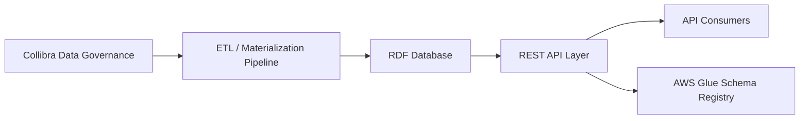
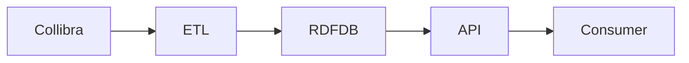
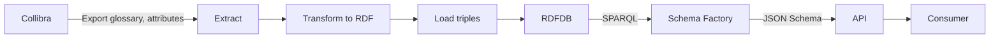
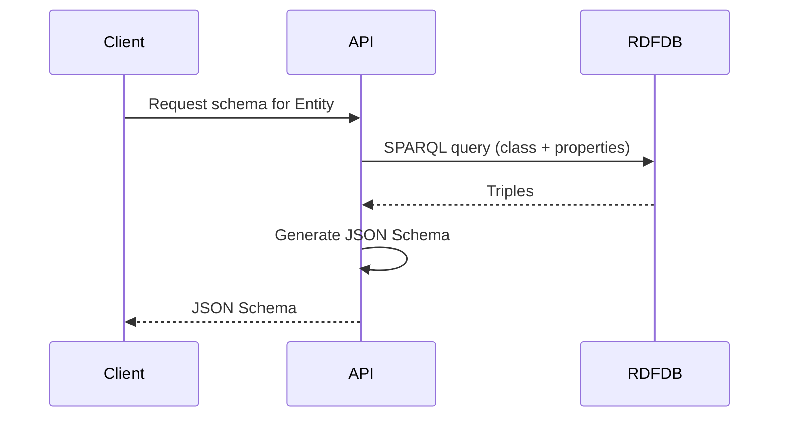

# System Design Specification (SDS)
## Collibra → RDF Logical Model → REST Data Contracts (JSON Schema)

---

## 1. Executive Summary

This System Design Specification (SDS) documents the end-to-end design of a data platform that transforms **enterprise data glossary and metadata** from Collibra into a **semantic logical data model (RDF)**, and exposes that model through a **REST API** that delivers **JSON Schema data contracts**.

The system establishes:
- A governed, semantic source of truth for entities and attributes
- Traceable data lineage from glossary terms to API contracts
- Controlled schema evolution and compatibility
- Abstraction of SPARQL behind stable REST interfaces

This document focuses on **data flows, transformation logic, semantic modeling, and contract generation**, rather than UI concerns.

---

## 2. Scope

### 2.1 In Scope
- Collibra metadata ingestion
- ETL/materialization into RDF
- RDF logical data model
- REST abstraction over RDF/SPARQL
- JSON Schema generation and versioning
- Governance and change management

### 2.2 Out of Scope
- End-user application UI
- Runtime data ingestion (business data)
- Form rendering or UI generation from schemas
- Non-JSON schema formats

---

## 3. Architectural Overview (C4 – Context)



---

## 4. Architectural Containers (C4 – Container View)

```mermaid
flowchart TB
  subgraph Governance
    Collibra[Collibra
Glossary + Metadata]
  end

  subgraph Processing
    ETL[ETL & Materialization
(RML/YARRRML-like)]
  end

  subgraph Semantic
    RDFDB[RDF Store
(Classes, Properties, Relationships)]
  end

  subgraph Access
    API[REST API
(Schema Factory Layer)]
    Cache[Optional Cache]
  end

  subgraph Contracts
    Glue[AWS Glue Schema Registry]
    Store[DynamoDB
Schema Metadata]
  end

  Collibra --> ETL
  ETL --> RDFDB
  RDFDB --> API
  API --> Cache
  API --> Glue
  API --> Store
```

---

## 5. Data Flow Diagrams

### 5.1 DFD Level 0 – High-Level Flow



### 5.2 DFD Level 1 – Expanded Flow



---

## 6. Canonical Data Models

### 6.1 Collibra Source Model
Collibra provides:
- Business terms
- Attribute definitions
- Domains
- Stewardship metadata
- Descriptions and constraints

These elements are treated as **authoritative metadata**, not instance data.

### 6.2 RDF Logical Data Model

#### 6.2.1 Core Concepts
- **Classes** → Entities (e.g., `Customer`, `Loan`)
- **Datatype Properties** → Attributes (e.g., `customerId`, `birthDate`)
- **Object Properties** → Relationships (e.g., `hasAccount`)
- **Labels/Descriptions** → Human-readable metadata

#### 6.2.2 Example (Conceptual)

```ttl
ex:Customer a owl:Class ;
  rdfs:label "Customer" ;
  rdfs:comment "A party that holds accounts" .

ex:customerId a owl:DatatypeProperty ;
  rdfs:domain ex:Customer ;
  rdfs:range xsd:string .
```

---

## 7. ETL & Materialization Specification

### 7.1 Mapping Strategy
- Collibra elements mapped to RDF via deterministic rules
- Stable URIs generated for classes and properties
- Provenance captured per ETL run

### 7.2 Provenance
- Named graphs per run
- PROV-O used to link:
  - Source artifact
  - Transformation activity
  - Generated triples

### 7.3 Error Handling
- Invalid glossary entries logged
- Partial loads allowed with warnings
- Idempotent re-runs supported

---

## 8. REST API & Schema Factory Layer

### 8.1 Purpose
The REST layer:
- Hides SPARQL complexity
- Provides stable, consumer-friendly endpoints
- Generates JSON Schemas dynamically from RDF

### 8.2 Example Endpoints
- `GET /schemas/entities`
- `GET /schemas/entities/{entityName}`
- `GET /schemas/entities/{entityName}/versions/latest`

### 8.3 Schema Generation Logic



### 8.4 SPARQL Query Patterns

This section documents the SPARQL query patterns used by the Schema Factory to retrieve entity definitions and generate JSON Schemas.

#### 8.4.1 Core Entity Query Pattern

**Purpose**: Retrieve all properties and metadata for a given RDF class.

**Query Template**:
```sparql
# TODO: Add SPARQL query for retrieving entity class definition
# Should include:
# - Class label and description
# - All datatype properties with domain = target class
# - All object properties with domain = target class
# - Property ranges, cardinality constraints
# - Optional: SHACL shape definitions
```

**Expected Result Structure**:
```
# TODO: Document expected result bindings
# Example: ?property ?propertyType ?range ?required ?description
```

#### 8.4.2 Property Details Query Pattern

**Purpose**: Retrieve detailed constraints for individual properties.

**Query Template**:
```sparql
# TODO: Add SPARQL query for property constraint retrieval
# Should include:
# - minLength, maxLength for strings
# - minimum, maximum for numeric types
# - enum values where applicable
# - pattern/format constraints
```

#### 8.4.3 Relationship Query Pattern

**Purpose**: Retrieve object properties (relationships between entities).

**Query Template**:
```sparql
# TODO: Add SPARQL query for retrieving relationships
# Should include:
# - Object property definitions
# - Domain and range classes
# - Cardinality (1-to-1, 1-to-many, many-to-many)
# - Inverse property definitions
```

#### 8.4.4 Enumeration Query Pattern

**Purpose**: Retrieve allowed values for enumerated properties.

**Query Template**:
```sparql
# TODO: Add SPARQL query for enum value retrieval
# Should handle both:
# - OWL enumeration classes
# - SKOS concept schemes
# - Simple value lists
```

#### 8.4.5 Schema Metadata Query Pattern

**Purpose**: Retrieve versioning and provenance metadata.

**Query Template**:
```sparql
# TODO: Add SPARQL query for schema metadata
# Should include:
# - ETL run ID and timestamp
# - Source Collibra asset IDs
# - Named graph identifier
# - Version information
```

#### 8.4.6 Query Optimization Considerations

**Caching Strategy**:
```
# TODO: Document caching approach
# - Cache duration for schema queries
# - Cache invalidation triggers
# - Cache key strategy
```

**Performance Targets**:
```
# TODO: Define SLOs
# - Query execution time: < X ms (p95)
# - Schema generation time: < Y ms (p95)
# - Concurrent request handling: Z req/sec
```

**Error Handling**:
```
# TODO: Document error scenarios
# - Missing properties: How to handle incomplete definitions
# - Query timeout: Fallback behavior
# - Malformed RDF: Validation and recovery
```

#### 8.4.7 Example Query Execution Flow

**For Entity "Customer"**:
```
# TODO: Add concrete example showing:
# 1. Input: Entity name = "Customer"
# 2. SPARQL queries executed (in sequence)
# 3. Intermediate RDF results
# 4. Final JSON Schema output
# 5. Execution time and performance metrics
```

#### 8.4.8 Named Graph Strategy

**Query Scope**:
```sparql
# TODO: Document how queries target specific named graphs
# Example patterns:
# - FROM <urn:graph:materialization:latest>
# - GRAPH ?g WHERE { ... }
# - Graph selection based on version/timestamp
```

**Graph Selection Logic**:
```
# TODO: Document rules for choosing which graph to query
# - Production queries: latest graph
# - Historical queries: specific run graph
# - Comparison queries: diff between graphs
```

---

## 9. JSON Schema Contract Model

### 9.1 Mapping Rules
- RDF Class → JSON Schema `type: object`
- Datatype Property → JSON Schema property
- Object Property → `$ref` to another entity schema
- Cardinality → required / array

### 9.2 Reuse & References
- `$defs` used for reusable entity definitions
- `$ref` used for relationships
- Inline vs referenced types governed by policy

---

## 10. Versioning & Compatibility

### 10.1 Version Strategy
- Major: breaking logical model changes
- Minor: additive attributes
- Patch: metadata-only changes

### 10.2 Enforcement
- Published schemas registered in AWS Glue
- Compatibility checked at publish time
- Glue version ID stored as canonical reference

---

## 11. Governance & Change Management

### 11.1 Change Triggers
- Collibra glossary updates
- Mapping rule changes
- RDF model evolution

### 11.2 Workflow
- Detect change
- Regenerate RDF and schemas
- Review & approve
- Publish new version

---

## 12. Security & Access

- AuthN/AuthZ at REST layer
- Read-only SPARQL access
- Schema publishing restricted
- Audit logging enabled

---

## 13. Observability

- ETL run metrics
- Schema generation latency
- Version publish events
- Compatibility failures

---

## 14. Risks & Mitigations

| Risk | Mitigation |
|----|-----------|
| Schema drift | Semantic model as source of truth |
| Breaking changes | Compatibility enforcement |
| Collibra inconsistency | Validation + stewardship |
| Consumer coupling | Stable REST contracts |

---

## 15. Summary

This SDS defines a **semantic-first architecture** where:
- Governance metadata drives logical models
- RDF provides explicit semantics and relationships
- REST APIs deliver stable JSON Schema contracts
- Compatibility and evolution are enforced centrally

The result is a traceable, governed, and scalable data contract platform.
