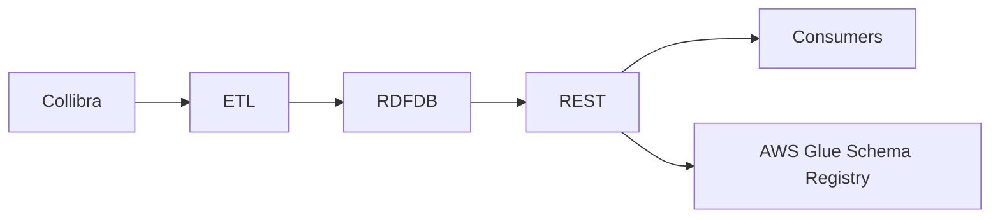
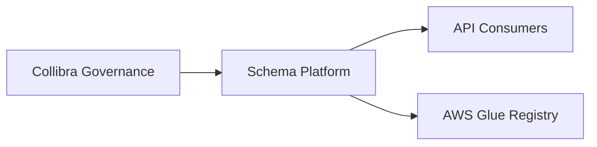
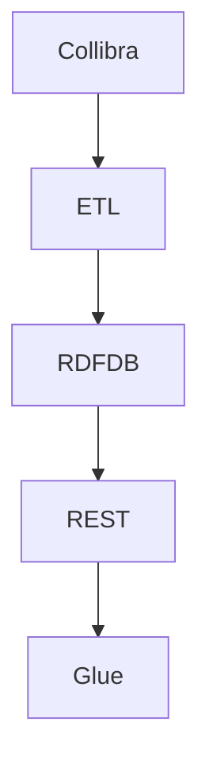
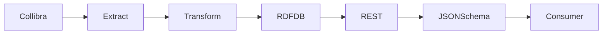

# System Design Specification (SDS)
## Collibra → RDF Logical Model → REST Data Contracts (JSON Schema)
### IEEE 42010 / ISO 15288 Aligned Version

---

## 1. Introduction

### 1.1 Purpose
This System Design Specification (SDS) defines the architecture, data flows, and implementation design for a system that transforms governed metadata from Collibra into semantic logical models (RDF) and exposes those models as versioned JSON Schema data contracts via REST APIs.

This document aligns with:
- IEEE 42010 (Architecture Description)
- ISO/IEC/IEEE 15288 (System Life Cycle Processes)

### 1.2 Scope
The system addresses metadata-driven schema generation, semantic modeling, and contract governance. It does not address runtime transactional data processing or end-user application behavior.

### 1.3 Stakeholders
- Data Governance
- Platform Engineering
- API Consumers
- Security and Compliance
- Architecture Review Board

---

## 2. System Context

### 2.1 System Overview
The system ingests enterprise glossary and attribute metadata from Collibra, materializes it into an RDF-based logical data model, and exposes derived JSON Schema contracts through a REST interface.

---

## 3. Architectural Concerns and Viewpoints

### 3.1 Concerns Addressed
- Traceability from business glossary to API contracts
- Controlled schema evolution
- Separation of governance and enforcement
- Semantic consistency across domains

### 3.2 Viewpoints Used
- Context View
- Container View
- Component View
- Data Flow View

---

## 4. Architectural Views

### 4.1 Context View

### 4.2 Container View

---

## 5. System Elements

### 5.1 Collibra Integration
Collibra provides authoritative metadata including glossary terms, attribute definitions, and stewardship information.

### 5.2 ETL and Materialization
ETL processes transform Collibra metadata into RDF triples using deterministic mapping rules. Each ETL execution is idempotent and traceable.

### 5.3 RDF Logical Data Model
The RDF store contains OWL classes, datatype properties, and object properties representing entities, attributes, and relationships.

### 5.4 REST Schema Factory
The REST layer abstracts SPARQL queries and dynamically generates JSON Schema representations of RDF entities.

### 5.5 Schema Registry
AWS Glue Schema Registry serves as the canonical store for published schema versions and enforces compatibility policies.

---

## 6. Information Model

### 6.1 Logical Information Model
The logical data model is represented in RDF to allow explicit semantics, relationships, and extensibility.

### 6.2 Contract Model
JSON Schema contracts are derived artifacts representing consumable views of the logical model.

---

## 7. Data Flow Specification

---

## 8. Lifecycle and Evolution

### 8.1 Schema Lifecycle States
- Draft
- Proposed
- Approved
- Published
- Deprecated

### 8.2 Change Control
All schema changes are reviewed and validated prior to publication. Compatibility is enforced at the publish boundary.

---

## 9. Security and Compliance

- Authentication and authorization enforced at REST boundary
- Least-privilege access for publishing operations
- Audit logs generated for all lifecycle transitions

---

## 10. Quality Attributes

| Attribute | Description |
|--------|------------|
| Maintainability | Semantic model centralizes logic |
| Traceability | Lineage preserved across layers |
| Interoperability | Standards-based representations |
| Governance | Approval workflows and auditing |

---

## 11. Assumptions and Constraints

- Collibra is authoritative for glossary metadata
- RDF is used as the logical modeling layer
- AWS is the deployment platform

---

## 12. Summary

This SDS describes a standards-aligned architecture for metadata-driven schema generation, combining governance, semantics, and API contract management into a cohesive system.
