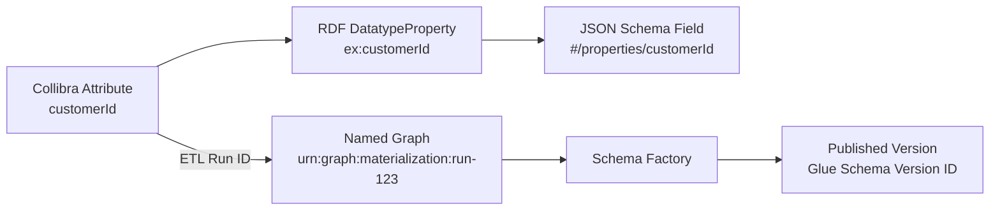

# Worked Example Appendix
## Collibra → RDF → SPARQL → REST → JSON Schema (End-to-End)

---

## 1. Purpose

This appendix provides a concrete, end-to-end example demonstrating how:
- Collibra metadata (glossary + attributes + relationships)
- becomes an RDF logical data model (triples),
- is queried via SPARQL (abstracted behind a factory layer),
- and is exposed to consumers as JSON Schema via REST endpoints.

This is intended as an implementation reference and validation artifact for engineering teams and reviewers.

---

## 2. Example Domain and Entities

### 2.1 Domain
- **Domain:** `customer`

### 2.2 Entities
- `Customer`
- `Account`

### 2.3 Relationship
- Customer **hasAccount** → Account (0..*)

---

## 3. Collibra Input (Conceptual Snapshot)

> Replace the IDs and properties with your real Collibra export fields.
> This section illustrates the minimal metadata needed to generate contracts.

### 3.1 Collibra “Entity” Assets

| Collibra Asset ID | Type | Name | Description |
|---|---|---|---|
| `collibra:CUST_ENTITY_001` | Entity | Customer | A party that holds accounts |
| `collibra:ACCT_ENTITY_001` | Entity | Account | A financial account owned by a customer |

### 3.2 Collibra “Attribute” Assets

| Collibra Asset ID | Entity | Attribute Name | Data Type | Required | Description | Constraints |
|---|---|---|---|---|---|---|
| `collibra:CUST_ATTR_001` | Customer | customerId | string | Yes | Unique identifier for customer | minLength=1 |
| `collibra:CUST_ATTR_002` | Customer | fullName | string | No | Full legal name | maxLength=200 |
| `collibra:ACCT_ATTR_001` | Account | accountId | string | Yes | Unique identifier for account | minLength=1 |
| `collibra:ACCT_ATTR_002` | Account | accountType | string | Yes | Account type | enum=["CHECKING","SAVINGS"] |

### 3.3 Collibra “Relationship” Assets

| Collibra Asset ID | Source Entity | Relationship | Target Entity | Cardinality | Description |
|---|---|---|---|---|---|
| `collibra:REL_001` | Customer | hasAccount | Account | 0..* | Customer may have multiple accounts |

---

## 4. Materialized RDF Output (Triples)

### 4.1 Namespaces (Example)
```ttl
@prefix ex: <http://example.com/model/> .
@prefix xsd: <http://www.w3.org/2001/XMLSchema#> .
@prefix owl: <http://www.w3.org/2002/07/owl#> .
@prefix rdfs: <http://www.w3.org/2000/01/rdf-schema#> .
```

### 4.2 RDF Classes (Entities)
```ttl
ex:Customer a owl:Class ;
  rdfs:label "Customer" ;
  rdfs:comment "A party that holds accounts" .

ex:Account a owl:Class ;
  rdfs:label "Account" ;
  rdfs:comment "A financial account owned by a customer" .
```

### 4.3 RDF Properties (Attributes)
```ttl
ex:customerId a owl:DatatypeProperty ;
  rdfs:label "customerId" ;
  rdfs:comment "Unique identifier for customer" ;
  rdfs:domain ex:Customer ;
  rdfs:range xsd:string .

ex:fullName a owl:DatatypeProperty ;
  rdfs:label "fullName" ;
  rdfs:comment "Full legal name" ;
  rdfs:domain ex:Customer ;
  rdfs:range xsd:string .

ex:accountId a owl:DatatypeProperty ;
  rdfs:label "accountId" ;
  rdfs:comment "Unique identifier for account" ;
  rdfs:domain ex:Account ;
  rdfs:range xsd:string .

ex:accountType a owl:DatatypeProperty ;
  rdfs:label "accountType" ;
  rdfs:comment "Account type" ;
  rdfs:domain ex:Account ;
  rdfs:range xsd:string .
```

### 4.4 RDF Object Property (Relationship)
```ttl
ex:hasAccount a owl:ObjectProperty ;
  rdfs:label "hasAccount" ;
  rdfs:comment "Customer may have multiple accounts" ;
  rdfs:domain ex:Customer ;
  rdfs:range ex:Account .
```

---

## 5. Optional Constraints Layer (SHACL Example)

This is optional but recommended to formalize requiredness and enumerations.

```ttl
@prefix sh: <http://www.w3.org/ns/shacl#> .

ex:CustomerShape a sh:NodeShape ;
  sh:targetClass ex:Customer ;
  sh:property [
    sh:path ex:customerId ;
    sh:datatype xsd:string ;
    sh:minCount 1 ;
  ] ;
  sh:property [
    sh:path ex:fullName ;
    sh:datatype xsd:string ;
    sh:maxLength 200 ;
  ] .

ex:AccountShape a sh:NodeShape ;
  sh:targetClass ex:Account ;
  sh:property [
    sh:path ex:accountId ;
    sh:datatype xsd:string ;
    sh:minCount 1 ;
  ] ;
  sh:property [
    sh:path ex:accountType ;
    sh:datatype xsd:string ;
    sh:minCount 1 ;
    sh:in ("CHECKING" "SAVINGS") ;
  ] .
```

---

## 6. SPARQL Queries Used by the Schema Factory

### 6.1 Fetch Entity (Class) Metadata
```sparql
SELECT ?class ?label ?comment WHERE {
  VALUES ?class { ex:Customer }
  OPTIONAL { ?class rdfs:label ?label }
  OPTIONAL { ?class rdfs:comment ?comment }
}
```

### 6.2 Fetch Datatype Properties for an Entity
```sparql
SELECT ?prop ?label ?comment ?range WHERE {
  ?prop rdfs:domain ex:Customer ;
        rdfs:range ?range .
  OPTIONAL { ?prop rdfs:label ?label }
  OPTIONAL { ?prop rdfs:comment ?comment }
}
```

### 6.3 Fetch Object Properties (Relationships) for an Entity
```sparql
SELECT ?prop ?label ?comment ?target WHERE {
  ?prop rdfs:domain ex:Customer ;
        rdfs:range ?target .
  FILTER EXISTS { ?prop a owl:ObjectProperty }
  OPTIONAL { ?prop rdfs:label ?label }
  OPTIONAL { ?prop rdfs:comment ?comment }
}
```

### 6.4 Fetch SHACL Constraints (Optional)
```sparql
SELECT ?path ?minCount ?maxLength ?inValue WHERE {
  ex:CustomerShape sh:property ?p .
  ?p sh:path ?path .
  OPTIONAL { ?p sh:minCount ?minCount }
  OPTIONAL { ?p sh:maxLength ?maxLength }
  OPTIONAL { ?p sh:in ?inList .
            ?inList rdf:rest*/rdf:first ?inValue }
}
```

---

## 7. REST API (Contract-Oriented Endpoints)

### 7.1 Endpoint: List Entities
**GET** `/schemas/entities`

**Response (Example)**
```json
{
  "domain": "customer",
  "entities": [
    { "name": "Customer", "id": "ex:Customer" },
    { "name": "Account", "id": "ex:Account" }
  ]
}
```

### 7.2 Endpoint: Get Entity Schema (Latest)
**GET** `/schemas/entities/Customer/versions/latest`

**Response:** JSON Schema for Customer (see Section 8).

### 7.3 Endpoint: Get Entity Schema by Version
**GET** `/schemas/entities/Customer/versions/1.2.0`

**Response:** JSON Schema matching that published version.

---

## 8. JSON Schema Output (Generated)

### 8.1 Design Notes
- Entity schemas are stored/referenced via `$defs`
- Relationships become `$ref` pointers
- Cardinality 0..* becomes array of `$ref`

### 8.2 Generated Schema: Customer (Example)

```json
{
  "$schema": "https://json-schema.org/draft/2020-12/schema",
  "$id": "schema://customer/Customer/1.2.0",
  "title": "Customer",
  "type": "object",
  "$defs": {
    "Account": {
      "$id": "schema://customer/Account/1.0.0",
      "title": "Account",
      "type": "object",
      "properties": {
        "accountId": {
          "type": "string",
          "description": "Unique identifier for account",
          "minLength": 1
        },
        "accountType": {
          "type": "string",
          "description": "Account type",
          "enum": ["CHECKING", "SAVINGS"]
        }
      },
      "required": ["accountId", "accountType"]
    }
  },
  "properties": {
    "customerId": {
      "type": "string",
      "description": "Unique identifier for customer",
      "minLength": 1
    },
    "fullName": {
      "type": "string",
      "description": "Full legal name",
      "maxLength": 200
    },
    "hasAccount": {
      "type": "array",
      "items": { "$ref": "#/$defs/Account" },
      "description": "Customer may have multiple accounts"
    }
  },
  "required": ["customerId"]
}
```

---

## 9. Versioning and Registry Publication (Example)

### 9.1 Publish Flow Summary
- Candidate schema generated from RDF
- Compatibility check performed (staging or at publish)
- Published schema registered in Glue
- Glue schema version ID recorded in platform metadata

### 9.2 Example Metadata Record (DynamoDB Concept)
```json
{
  "subject": "customer.Customer",
  "version": "1.2.0",
  "status": "PUBLISHED",
  "glueSchemaVersionId": "b4d9a0f6-xxxx-xxxx-xxxx-xxxxxxxxxxxx",
  "publishedAt": "2026-01-12T00:00:00Z",
  "publishedBy": "user:alice",
  "artifactS3Uri": "s3://schema-artifacts/customer/Customer/1.2.0/schema.json"
}
```

---

## 10. End-to-End Traceability Summary



---

## 11. Acceptance Criteria for This Example

This worked example is correct if:
- RDF classes and properties reflect the intended logical model
- SPARQL queries return sufficient metadata to generate schema
- JSON Schema is valid Draft 2020-12
- Requiredness and constraints are consistent with Collibra/SHACL
- Relationships map to `$ref` (or arrays of `$ref`) correctly
- Version metadata links schema artifacts to registry identifiers

---
