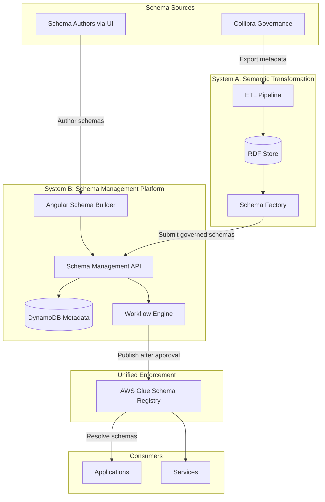
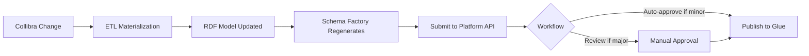
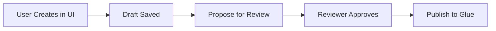
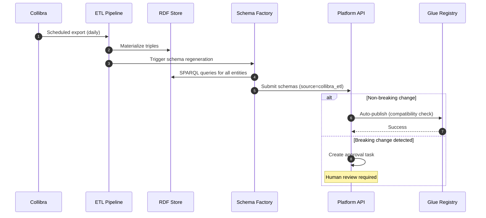
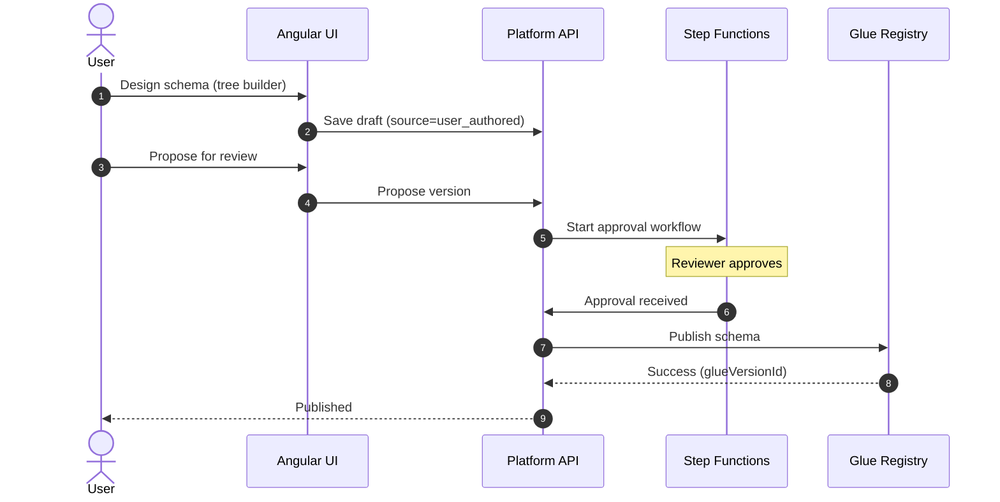
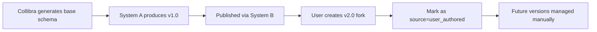
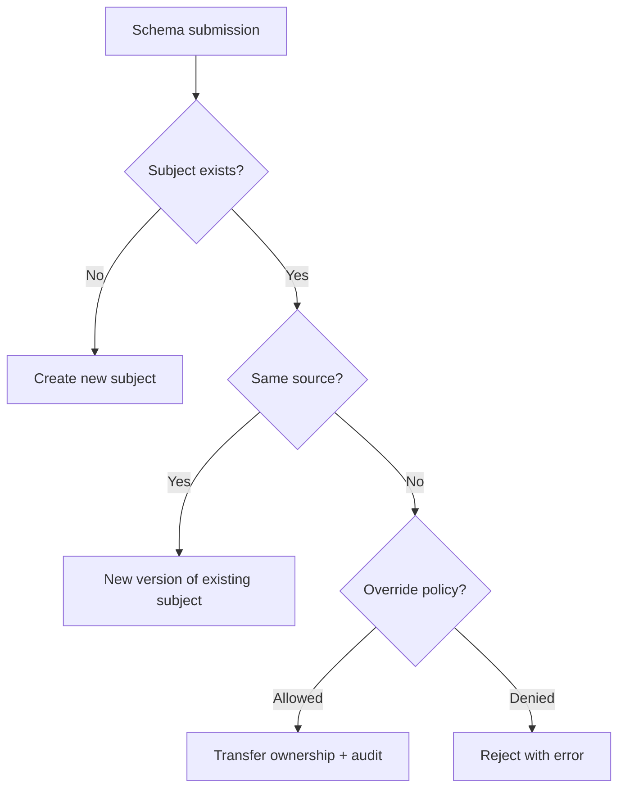
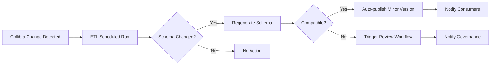

# System Integration Architecture
## Unified Schema Platform: Integration of Semantic Transformation and Schema Management Systems

---

## 1. Executive Summary

This document defines how **System A (Collibra → RDF → JSON Schema)** and **System B (Schema Management Platform)** integrate to form a unified, enterprise-grade schema platform.

**Key Integration Principle:**  
System A provides **automated schema generation from governance metadata**, while System B provides the **platform infrastructure for lifecycle management, approval, and enforcement**. Both systems converge at the **AWS Glue Schema Registry** enforcement boundary.

---

## 2. Integration Architecture Overview

### 2.1 High-Level Integration View



### 2.2 Integration Points

| Integration Point | System A Role | System B Role | Mechanism |
|-------------------|---------------|---------------|-----------|
| **Schema Submission** | Generates schemas from RDF | Receives and validates submissions | REST API |
| **Lifecycle Management** | N/A - System A schemas enter as "Proposed" | Manages draft → review → publish | Workflow engine |
| **Compatibility Check** | Same rules apply | Enforces at publish boundary | AWS Glue API |
| **Schema Registry** | Registers semantic schemas | Registers authored schemas | AWS Glue (unified) |
| **Metadata Storage** | Stores RDF provenance | Stores lifecycle metadata | Separate databases |
| **Consumer Access** | N/A - delegates to System B | Unified API for all schemas | REST API |

---

## 3. Schema Lifecycle Integration

### 3.1 System A: Governed Schema Flow



**Key Characteristics:**
- **Origin**: `source: "collibra_etl"`
- **Automation**: Can be auto-approved for non-breaking changes
- **Immutability**: Schema content derived from RDF (not editable via UI)
- **Traceability**: Includes Collibra asset IDs in metadata

### 3.2 System B: Authored Schema Flow



**Key Characteristics:**
- **Origin**: `source: "user_authored"`
- **Interactivity**: Full UI editing capabilities
- **Approval**: Always requires human approval
- **Ownership**: Domain/user ownership metadata

### 3.3 Unified Lifecycle States

Both schema types share the same lifecycle states:

| State | Description | System A | System B |
|-------|-------------|----------|----------|
| **Draft** | Editable, not reviewed | Generated but not submitted | User creating |
| **Proposed** | Submitted for review | After ETL submission | After user proposes |
| **Approved** | Passed review, ready to publish | Auto or manual | Manual only |
| **Published** | Registered in Glue, immutable | ✅ | ✅ |
| **Deprecated** | Marked for retirement | ✅ | ✅ |

---

## 4. Data Model Integration

### 4.1 Unified Schema Metadata Schema

```json
{
  "schemaSubject": {
    "subjectId": "string",
    "domain": "string",
    "owner": "string",
    "source": "collibra_etl | user_authored",
    "compatibilityMode": "BACKWARD | FORWARD | FULL"
  },
  "schemaVersion": {
    "versionId": "string",
    "versionNumber": "integer",
    "status": "DRAFT | PROPOSED | APPROVED | PUBLISHED | DEPRECATED",
    "glueVersionId": "string",
    "source": "collibra_etl | user_authored",
    "collibraAssetId": "string | null",
    "rdfClassIRI": "string | null",
    "author": "string",
    "approver": "string | null",
    "publishedAt": "timestamp | null"
  }
}
```

### 4.2 Source-Specific Metadata

#### System A (Collibra-Derived)
```json
{
  "sourceMetadata": {
    "type": "collibra_etl",
    "collibraAssetId": "collibra:ENTITY_001",
    "rdfClassIRI": "ex:Customer",
    "etlRunId": "run-2026-01-13-001",
    "materializationGraph": "urn:graph:materialization:latest",
    "lineageLink": "https://lineage.example.com/entity/Customer"
  }
}
```

#### System B (User-Authored)
```json
{
  "sourceMetadata": {
    "type": "user_authored",
    "authorUserId": "user@example.com",
    "createdViaUI": true,
    "templateUsed": "standard-entity | event | null"
  }
}
```

---

## 5. Integration Patterns

### 5.1 Pattern 1: Automated Governed Schema Publication

**Use Case**: Collibra metadata changes trigger automatic schema updates.



**Configuration:**
- Scheduled ETL runs (e.g., daily at 2 AM)
- Auto-publish policy: `BACKWARD` compatibility only
- Alert governance team for breaking changes

### 5.2 Pattern 2: User-Authored Schema Creation

**Use Case**: Domain expert creates new schema not yet in Collibra.



**Policy:**
- All user-authored schemas require approval
- Optionally synchronize back to Collibra after publication

### 5.3 Pattern 3: Hybrid Refinement

**Use Case**: Start with Collibra-generated schema, refine manually.



**Governance:**
- Forking a governed schema changes source to `user_authored`
- Original Collibra lineage preserved in metadata
- Reconciliation workflow notifies stewards

---

## 6. Decision Criteria: Which System to Use?

### 6.1 Use System A (Collibra → RDF → Schema) When:

✅ Schema structure is **already defined in Collibra** governance  
✅ You need **semantic relationships** and reasoning  
✅ Schema should **automatically update** when governance metadata changes  
✅ Multiple schemas share common entities (reuse via RDF)  
✅ Lineage from business glossary to API contract is critical  

**Examples:**
- Core enterprise entities (Customer, Product, Account)
- Canonical data models governed by data stewardship
- Cross-domain integration contracts

### 6.2 Use System B (Guided UI Authoring) When:

✅ Schema is **event-specific or application-specific**  
✅ Governance metadata **not yet available** in Collibra  
✅ Rapid iteration needed (prototype, MVP)  
✅ Team lacks RDF/SPARQL expertise  
✅ Schema is a **one-off contract** not reused elsewhere  

**Examples:**
- Event schemas for application-specific events
- API request/response schemas for new microservices
- Internal tool contracts

### 6.3 Hybrid Approach

Start with System A for governance-driven base schemas, then extend/customize via System B for application-specific variants.

---

## 7. Conflict Resolution & Deduplication

### 7.1 Namespace Strategy

**Approach**: Use subject naming convention to prevent collisions.

| Source | Subject Prefix | Example |
|--------|----------------|---------|
| System A (Collibra) | `gov.{domain}.{entity}` | `gov.customer.Customer` |
| System B (Authored) | `app.{service}.{schema}` | `app.orderservice.OrderCreated` |

### 7.2 Collision Handling

If a schema with the same subject exists:



**Default Policy**: Same subject cannot be owned by both sources simultaneously.

### 7.3 Reconciliation Workflow

When a user-authored schema is later added to Collibra:
1. Governance team updates Collibra metadata
2. ETL generates equivalent schema
3. Platform detects overlap (by structure similarity)
4. Notification sent to schema owner
5. Owner can:
   - Migrate to governed version
   - Keep user version (with justification)
   - Merge into Collibra definition

---

## 8. Consumer Perspective: Unified Access

### 8.1 Consumer-Agnostic API

Consumers access **all schemas through a single API** regardless of source:

```
GET /api/v1/schemas/{subject}/versions/latest
GET /api/v1/schemas/{subject}/versions/{version}
GET /api/v1/schemas?domain=customer
```

**Response includes source metadata:**
```json
{
  "subject": "gov.customer.Customer",
  "version": "1.2.0",
  "source": "collibra_etl",
  "schema": { /* JSON Schema */ },
  "metadata": {
    "collibraAssetId": "collibra:CUST_001",
    "lineageUrl": "https://lineage.example.com/entity/Customer"
  }
}
```

### 8.2 Source Transparency

Consumers can:
- Filter by source: `/api/v1/schemas?source=collibra_etl`
- View lineage for governed schemas
- Understand schema authority and change frequency

---

## 9. Change Propagation

### 9.1 Collibra → Platform Propagation



**SLA**: Changes in Collibra reflected in published schemas within 24 hours.

### 9.2 Platform → Collibra Synchronization (Optional)

User-authored schemas can optionally be:
1. Exported to Collibra as "proposed" glossary terms
2. Reviewed by data stewards
3. Promoted to governed status
4. Future updates managed by System A

---

## 10. Implementation Checklist

### Phase 1: Core Integration (MVP)
- [ ] Extend Platform API to accept `source` parameter
- [ ] Add source-specific metadata schema to DynamoDB
- [ ] Implement Schema Factory → Platform API submission endpoint
- [ ] Configure separate approval policies by source
- [ ] Test end-to-end flow for both sources

### Phase 2: Automation
- [ ] Scheduled ETL → Schema Factory → Platform pipeline
- [ ] Auto-publish policy engine for backward-compatible changes
- [ ] Alerting for breaking changes requiring review

### Phase 3: Advanced Features
- [ ] Schema similarity detection (deduplication)
- [ ] Hybrid schema forking workflow
- [ ] Bi-directional Collibra synchronization
- [ ] Consumer analytics by schema source

---

## 11. Security & Authorization

### 11.1 Role Mapping

| Role | System A Access | System B Access |
|------|----------------|-----------------|
| **Data Steward** | Can trigger ETL, view RDF | Can approve governed schemas |
| **Schema Author** | Read-only | Can author and propose |
| **Reviewer** | N/A | Can approve user-authored |
| **Platform Admin** | Can configure ETL | Can configure policies |
| **Consumer** | Read published schemas | Read published schemas |

### 11.2 System-to-System Auth

- Schema Factory → Platform API: Service account with `schema:submit:governed` permission
- ETL Pipeline → RDF Store: IAM role with read/write to named graphs
- Platform API → Glue: IAM role with `glue:RegisterSchemaVersion` permission

---

## 12. Monitoring & Observability

### 12.1 Key Metrics

| Metric | Description | Alert Threshold |
|--------|-------------|-----------------|
| `etl.schema_changes_detected` | Schemas changed in Collibra | >50/day (anomaly) |
| `factory.generation_failures` | Schema generation errors | >5% |
| `platform.source_ratio` | Governed vs authored | Tracked for visibility |
| `glue.compatibility_failures` | Rejected schemas | >10/day |

### 12.2 Dashboards

- **ETL Health**: Run status, duration, error rates
- **Schema Sources**: Breakdown of governed vs authored
- **Compatibility Trends**: Pass/fail rates over time
- **Consumer Usage**: Top schemas by retrieval count

---

## 13. Migration & Coexistence

### 13.1 Existing System Migration

If existing schemas are already in use:

1. **Inventory**: Catalog all existing schemas
2. **Classify**: Determine if governed (→ Collibra) or authored
3. **Import**: Bulk import to Platform with appropriate source tags
4. **Dual-run**: Maintain old system temporarily
5. **Cutover**: Redirect consumers to unified API
6. **Decommission**: Retire old system

### 13.2 Coexistence Period

During migration:
- Both old and new APIs serve schemas
- Schema Registry acts as proxy/bridge
- Gradual consumer migration with rollback capability

---

## 14. Future Enhancements

### 14.1 Intelligent Routing

Use ML to recommend whether a schema should be:
- Governed (→ System A)
- Authored (→ System B)
- Based on similarity to existing governed schemas

### 14.2 Semantic Search

Enable consumers to:
- Search schemas by business terms (using RDF)
- Discover related schemas via semantic relationships
- Even for user-authored schemas (via NLP embedding)

### 14.3 Schema Templates

Generate System B authoring templates from frequently used System A patterns.

---

## 15. Summary

This integration architecture establishes:

✅ **Clear separation**: Governed vs authored schema sources  
✅ **Unified enforcement**: Both converge at AWS Glue  
✅ **Flexible workflows**: Automated + manual paths  
✅ **Consumer transparency**: Single API with source metadata  
✅ **Traceability**: End-to-end lineage preserved  
✅ **Scalability**: Independent evolution of both systems  

The result is an enterprise platform that combines the **rigor of semantic governance** with the **agility of guided authoring**.

---

## Related Documents

- [README.md](README.md) - Documentation navigation
- [System-Design-Specification-Collibra-RDF-JSON-Schema.md](System-Design-Specification-Collibra-RDF-JSON-Schema.md) - System A details
- [json-schema-management-system-engineering.md](json-schema-management-system-engineering.md) - System B details
- [ADR-001-schema-registry-strategy.md](ADR-001-schema-registry-strategy.md) - Registry selection rationale
