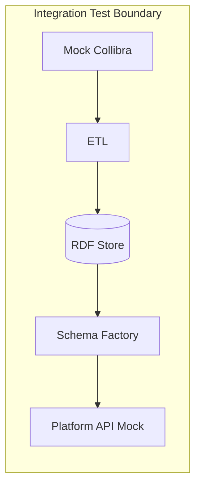
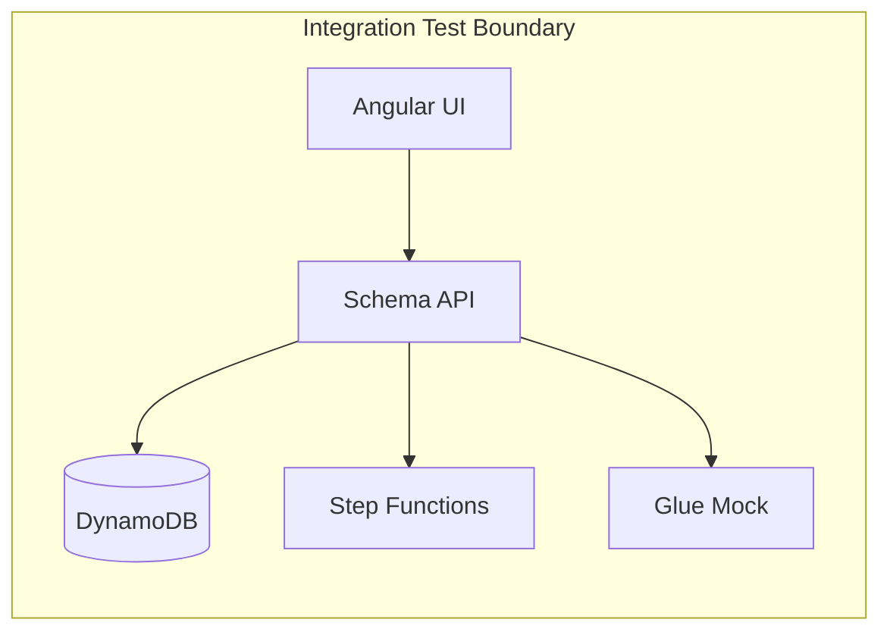
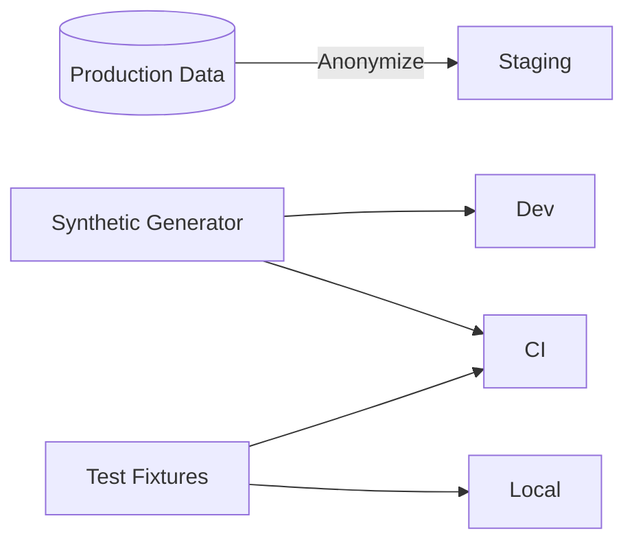
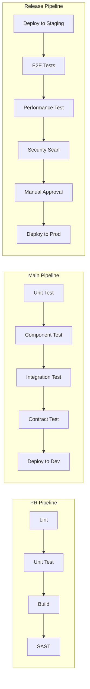

# Testing Strategy
## JSON Schema & Semantic Data Platform

---

## 1. Purpose

This document defines the testing strategy for both System A (Semantic Transformation Pipeline) and System B (Schema Management Platform). It establishes testing levels, responsibilities, coverage requirements, and quality gates that must be satisfied before production deployment.

---

## 2. Testing Philosophy

### 2.1 Core Principles


1. **Shift Left**: Catch defects early through unit and integration tests
2. **Contract-First**: API and schema contracts are tested independently
3. **Automation-First**: All tests must be automatable; manual testing is exploratory only
4. **Production Parity**: Test environments mirror production as closely as possible
5. **Traceability**: Every test maps to a requirement or user story

### 2.2 Test Pyramid Strategy

```
                    ┌─────────────┐
                    │   E2E (5%)  │  ← Few, critical user journeys
                   ┌┴─────────────┴┐
                   │ Integration   │  ← Service boundaries, APIs
                   │    (20%)      │
                  ┌┴───────────────┴┐
                  │  Component/     │  ← Individual services in isolation
                  │  Service (25%)  │
                 ┌┴─────────────────┴┐
                 │    Unit (50%)     │  ← Functions, classes, modules
                 └───────────────────┘
```

---

## 3. Testing Levels

### 3.1 Unit Testing

**Scope**: Individual functions, classes, and modules in isolation

**System A Coverage**:
| Component | Key Test Cases | Coverage Target |
|-----------|----------------|-----------------|
| RDF Mapping Rules | Rule C2R-01, C2R-02, C2R-03 transformations | 95% |
| URI Generation | Deterministic URI construction | 100% |
| SPARQL Query Builders | Query string generation | 90% |
| JSON Schema Generators | RDF → JSON Schema mapping rules | 95% |

**System B Coverage**:
| Component | Key Test Cases | Coverage Target |
|-----------|----------------|-----------------|
| Schema Validator | Syntax validation, org rule validation | 95% |
| Compatibility Gate | Version comparison logic | 95% |
| Workflow Orchestrator | State transitions, approval logic | 90% |
| AST Operations | Node manipulation, $ref resolution | 95% |
| Export Pipeline | AST → JSON Schema transformation | 100% |

**Angular UI Unit Tests**:
| Component | Key Test Cases | Coverage Target |
|-----------|----------------|-----------------|
| SchemaTreeComponent | Rendering, navigation, context menu | 85% |
| NodeWizardComponent | Form validation, type selection | 90% |
| TypesLibraryComponent | CRUD operations, ref counting | 85% |
| AST Store | State mutations, undo/redo | 95% |

**Tools & Frameworks**:
- Backend: pytest / Jest (depending on implementation language)
- Angular: Jasmine + Karma, Jest
- Mocking: unittest.mock / jest.mock, Spectator

---

### 3.2 Component/Service Testing

**Scope**: Individual services tested with real databases (local/containerized), mocked external services

**System A Tests**:
| Test Suite | Description | Dependencies |
|------------|-------------|--------------|
| ETL Pipeline | End-to-end materialization with sample data | RDF Store (containerized) |
| Schema Factory | Query execution and schema generation | RDF Store (containerized) |
| Collibra Connector | API integration with mock Collibra | Wiremock / Mock Server |

**System B Tests**:
| Test Suite | Description | Dependencies |
|------------|-------------|--------------|
| Schema Management API | All API endpoints | DynamoDB Local, S3 Local |
| Workflow Engine | Step Functions Local | Step Functions Local |
| Glue Integration | Registry operations | Glue Mock / LocalStack |

**Test Data Management**:
```
test-data/
├── collibra-exports/        # Sample Collibra export snapshots
│   ├── minimal.json
│   ├── complex-relationships.json
│   └── edge-cases.json
├── rdf-fixtures/            # Known-good RDF outputs
│   ├── customer-entity.ttl
│   └── full-domain.ttl
├── schema-fixtures/         # Expected JSON Schema outputs
│   ├── customer-v1.json
│   └── customer-v2-breaking.json
└── workflow-fixtures/       # Approval workflow states
    └── approval-scenarios.json
```

---

### 3.3 Integration Testing

**Scope**: Interaction between services, system boundaries, external system contracts

#### 3.3.1 System A Integration Tests



| Test Case | Input | Expected Output | Validates |
|-----------|-------|-----------------|-----------|
| Full ETL Pipeline | Collibra export JSON | RDF triples in store | Data flow integrity |
| Schema Generation | Entity name | Valid JSON Schema | Query + transform logic |
| Lineage Tracking | Entity with Collibra IDs | Schema with lineage metadata | Traceability |
| Incremental Update | Changed Collibra export | Delta RDF update | Idempotency |

#### 3.3.2 System B Integration Tests



| Test Case | Input | Expected Output | Validates |
|-----------|-------|-----------------|-----------|
| Draft → Publish Flow | New schema | Published in Glue | Full lifecycle |
| Compatibility Rejection | Breaking change | Rejection with reason | Glue integration |
| Approval Workflow | Proposed version | Approved status | Step Functions |
| Consumer Fetch | Subject + version | Schema content | API contract |

#### 3.3.3 Cross-System Integration

| Test Case | Description | Systems | Priority |
|-----------|-------------|---------|----------|
| Governed Schema Flow | System A output → System B publish | A → B | Critical |
| Namespace Collision | Duplicate subject handling | A + B | High |
| Consumer Resolution | Unified API returns both schema types | A + B | High |

---

### 3.4 Contract Testing

**Purpose**: Ensure API contracts remain stable and compatible across versions

**Provider Tests** (Schema Management API):
```yaml
interactions:
  - description: Fetch latest published schema
    request:
      method: GET
      path: /api/v1/schemas/gov.customer.Customer/versions/latest
    response:
      status: 200
      body:
        subject: "gov.customer.Customer"
        version: "1.0.0"
        source: "collibra_etl"
        schema:
          type: object
          properties:
            matchesContract: true
```

**Consumer Tests**:
- Validate that consumers can parse responses
- Test backward compatibility when API evolves
- Alert on breaking changes before deployment

**Tools**: Pact, Spring Cloud Contract, or OpenAPI diff tools

---

### 3.5 End-to-End (E2E) Testing

**Scope**: Critical user journeys through deployed system

**Critical User Journeys**:

| Journey | Steps | Success Criteria |
|---------|-------|------------------|
| **J1: Author and Publish Schema** | Create → Edit → Propose → Approve → Publish | Schema available via API |
| **J2: Governed Schema Publication** | ETL runs → Factory generates → Auto-publish | Schema registered in Glue |
| **J3: Breaking Change Detection** | Modify schema → Propose → Compatibility fail | Clear rejection message |
| **J4: Consumer Schema Resolution** | Request schema → Receive valid content | Correct schema returned |
| **J5: Schema Deprecation** | Deprecate → Consumers notified | Status = Deprecated |

**E2E Test Environment**:
```
┌─────────────────────────────────────────────────────┐
│                 E2E Test Environment                │
├─────────────────────────────────────────────────────┤
│  - Isolated AWS account or LocalStack              │
│  - Seeded test data (known Collibra snapshots)     │
│  - Automated via CI/CD pipeline                    │
│  - Runs nightly + pre-release                      │
└─────────────────────────────────────────────────────┘
```

**Tools**: Playwright (UI), Postman/Newman (API), custom test harness

---

## 4. Specialized Testing

### 4.1 Schema Compatibility Testing

**Purpose**: Validate compatibility rules before reaching Glue

| Scenario | Base Schema | New Schema | Expected Result |
|----------|-------------|------------|-----------------|
| Add optional field | `{a: string}` | `{a: string, b?: string}` | BACKWARD ✅ |
| Add required field | `{a: string}` | `{a: string, b: string}` | BACKWARD ❌ |
| Remove field | `{a: string, b: string}` | `{a: string}` | FORWARD ❌ |
| Change type | `{a: string}` | `{a: number}` | ALL ❌ |
| Widen type | `{a: {enum: ["A"]}}` | `{a: {enum: ["A","B"]}}` | BACKWARD ✅ |
| Narrow type | `{a: {enum: ["A","B"]}}` | `{a: {enum: ["A"]}}` | FORWARD ✅ |

### 4.2 RDF Transformation Testing

**Purpose**: Validate semantic correctness of RDF materialization

| Test Type | Description | Validation |
|-----------|-------------|------------|
| Ontology Conformance | Generated triples conform to target ontology | SHACL validation |
| Idempotency | Re-running ETL produces identical results | Triple diff |
| Completeness | All Collibra entities represented | Count comparison |
| Provenance | Lineage triples present | SPARQL query |

### 4.3 UI Accessibility Testing

| Standard | Tool | Automation |
|----------|------|------------|
| WCAG 2.1 AA | axe-core | CI gate |
| Keyboard Navigation | Playwright | E2E tests |
| Screen Reader | Manual + NVDA | Release checklist |

### 4.4 Security Testing

| Test Type | Scope | Frequency |
|-----------|-------|-----------|
| SAST | Code scanning | Every PR |
| Dependency Scanning | Known CVEs | Daily |
| DAST | Running application | Weekly |
| Penetration Testing | Full system | Annually / major release |

---

## 5. Test Environments

### 5.1 Environment Matrix

| Environment | Purpose | Data | Refresh |
|-------------|---------|------|---------|
| **Local** | Developer testing | Synthetic | N/A |
| **CI** | Automated pipeline | Synthetic | Per build |
| **Dev** | Integration testing | Synthetic | Daily |
| **Staging** | Pre-prod validation | Anonymized prod | Weekly |
| **Prod** | Production | Real | N/A |

### 5.2 Test Data Strategy



**Synthetic Data Characteristics**:
- Representative of production variety
- No PII or sensitive data
- Includes edge cases and boundary conditions
- Version controlled

---

## 6. Quality Gates

### 6.1 Pull Request Gate

| Check | Threshold | Blocking? |
|-------|-----------|-----------|
| Unit Test Pass | 100% | ✅ Yes |
| Unit Test Coverage | ≥ 80% | ✅ Yes |
| Linting | 0 errors | ✅ Yes |
| SAST Scan | 0 critical/high | ✅ Yes |
| Build Success | Pass | ✅ Yes |

### 6.2 Pre-Deployment Gate (Staging)

| Check | Threshold | Blocking? |
|-------|-----------|-----------|
| Integration Tests | 100% pass | ✅ Yes |
| E2E Tests (critical) | 100% pass | ✅ Yes |
| Contract Tests | 100% pass | ✅ Yes |
| Performance Baseline | Within 10% | ⚠️ Warning |
| Security Scan | 0 critical | ✅ Yes |

### 6.3 Production Release Gate

| Check | Threshold | Blocking? |
|-------|-----------|-----------|
| All staging gates | Pass | ✅ Yes |
| Manual QA Sign-off | Approved | ✅ Yes |
| Rollback Plan Verified | Documented | ✅ Yes |
| Runbook Updated | Reviewed | ✅ Yes |

---

## 7. Test Automation & CI/CD Integration

### 7.1 Pipeline Stages



### 7.2 Test Reporting

| Metric | Target | Dashboard |
|--------|--------|-----------|
| Test Pass Rate | > 99% | CI Dashboard |
| Test Execution Time | < 15 min (PR) | CI Dashboard |
| Flaky Test Rate | < 1% | Quality Dashboard |
| Coverage Trend | Stable/Improving | SonarQube |

---

## 8. Roles & Responsibilities

| Role | Testing Responsibility |
|------|------------------------|
| **Developer** | Unit tests, component tests, fix failing tests |
| **QA Engineer** | Integration tests, E2E tests, test strategy |
| **Platform Team** | Test infrastructure, CI/CD pipelines |
| **Security** | Security tests, penetration testing |
| **Product Owner** | UAT sign-off, acceptance criteria |

---

## 9. Test Documentation Requirements

Each test must include:
- **Test ID**: Unique identifier
- **Description**: What is being tested
- **Preconditions**: Required state before test
- **Steps**: Actions performed
- **Expected Result**: Success criteria
- **Traceability**: Link to requirement/story

---

## 10. Risk-Based Testing Focus

| Risk Area | Testing Focus | Priority |
|-----------|---------------|----------|
| Breaking schema changes | Compatibility tests | 🔴 Critical |
| Data loss in ETL | Transformation tests | 🔴 Critical |
| Authorization bypass | Security tests | 🔴 Critical |
| API contract breaks | Contract tests | 🟡 High |
| UI usability issues | E2E + accessibility | 🟡 High |
| Performance degradation | Performance tests | 🟢 Medium |

---

## 11. Summary

This testing strategy ensures:
- ✅ High confidence in schema transformation correctness
- ✅ API contract stability through contract testing
- ✅ Compatibility enforcement validated before production
- ✅ Security and compliance through automated scanning
- ✅ Quality gates prevent defects from reaching production

---

## Related Documents

- [System Integration Architecture](System-Integration-Architecture.md)
- [Risk & Compliance Appendix](json-schema-platform-risk-compliance-appendix.md)
- [Operations & Observability Guide](Operations-Observability-Guide.md)
