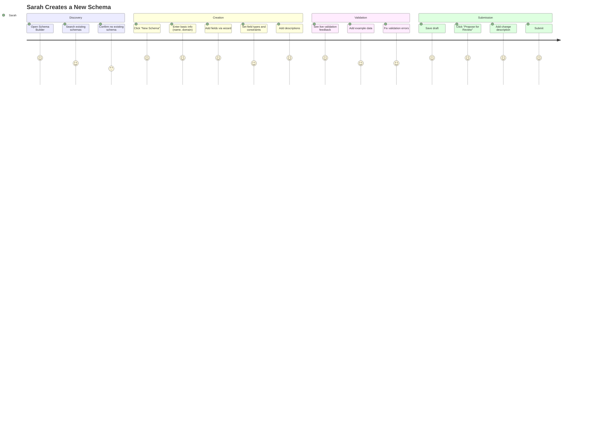
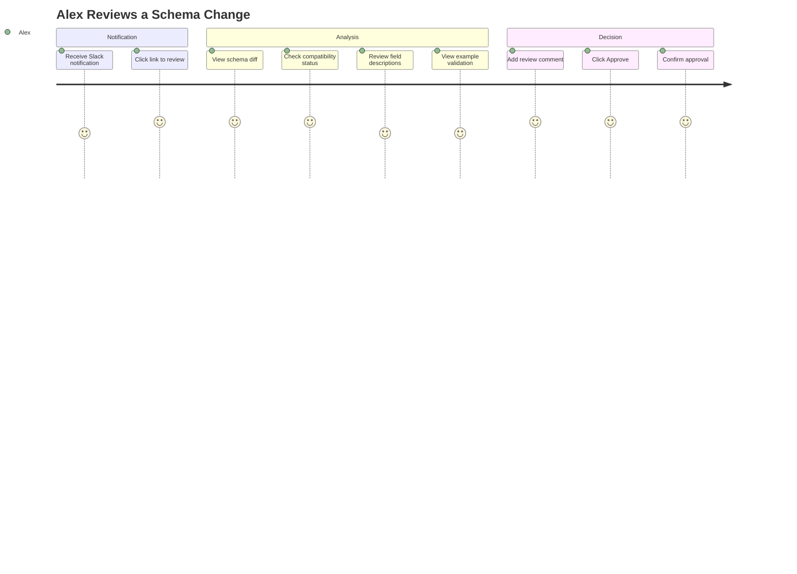
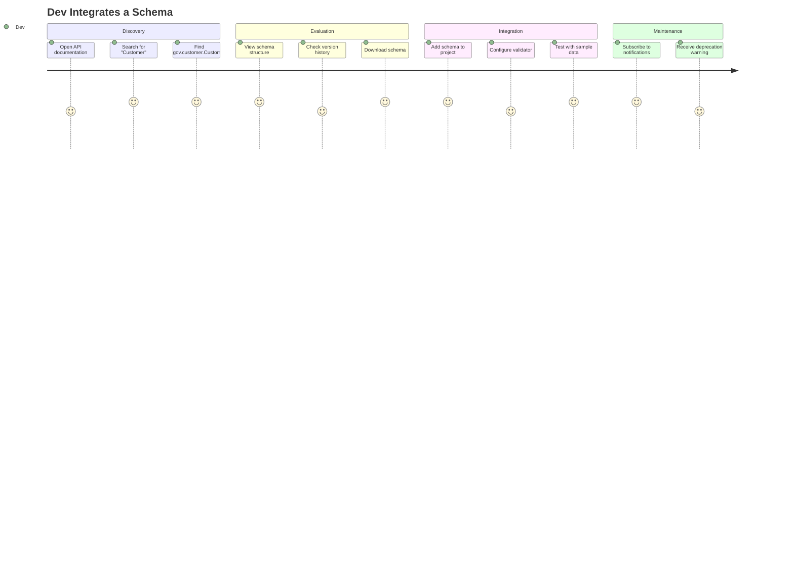
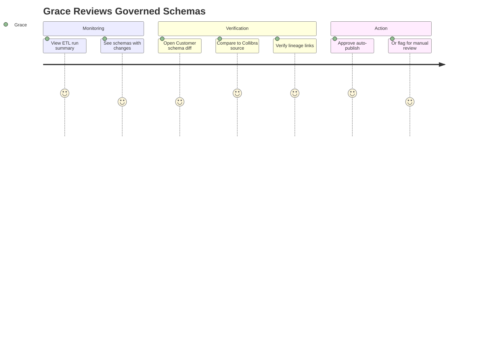
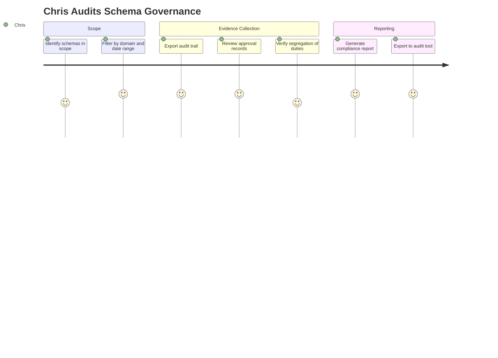
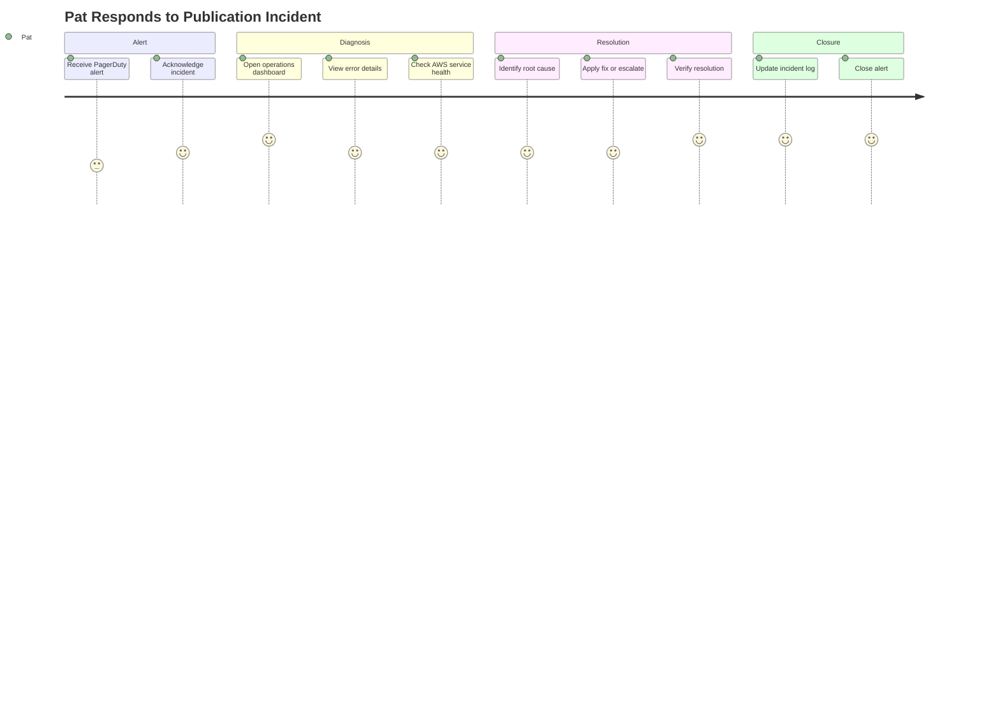
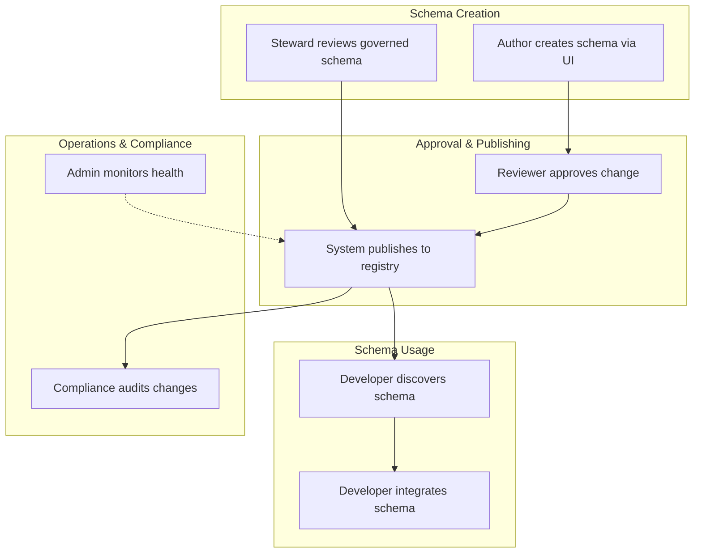

# User Journey Documentation
## JSON Schema & Semantic Data Platform

---

## 1. Purpose

This document captures the key user journeys for the JSON Schema & Semantic Data Platform. User journeys describe how different personas interact with the system to accomplish their goals, validating that the platform design serves real user needs.

---

## 2. Personas

### 2.1 Persona Overview

| Persona | Role | Goals | Pain Points |
|---------|------|-------|-------------|
| **Schema Author** | Domain expert, data analyst | Create accurate schemas without JSON expertise | Complexity of JSON Schema syntax; fear of making mistakes |
| **Data Steward** | Governance team member | Ensure schemas align with enterprise definitions | Manual reconciliation; lack of traceability |
| **Reviewer** | Senior engineer, architect | Validate schema quality before publication | Time pressure; incomplete context for decisions |
| **Consumer Developer** | Application developer | Find and use correct schema versions | Outdated docs; breaking changes without warning |
| **Platform Admin** | Operations/Platform team | Maintain platform health and policies | Alert fatigue; configuration complexity |
| **Compliance Officer** | Audit/Risk team | Verify change control and traceability | Gathering evidence across systems |

---

## 3. User Journeys

### 3.1 Journey: Author Creates a New Schema

**Persona**: Schema Author (Sarah, Data Analyst)

**Goal**: Create a JSON Schema for a new "Order" entity without writing JSON manually

**Context**: Sarah's team needs a schema for order data. She understands the business domain but has never written JSON Schema.

**Step-by-Step Flow**:

| Step | Action | System Response | Sarah's Feeling |
|------|--------|-----------------|-----------------|
| 1 | Opens Schema Builder UI | Dashboard shows recent schemas, search bar | Oriented, knows where to start |
| 2 | Searches for "Order" | Shows 0 results in her domain | Confident she needs to create new |
| 3 | Clicks "Create New Schema" | Opens creation wizard | Guided, not overwhelmed |
| 4 | Enters name: "Order", domain: "ecommerce" | Validates name format, suggests namespace | Clear expectations |
| 5 | Clicks "Add Field" | Opens field wizard with type selector | Easy to understand |
| 6 | Names field "orderId", selects "string" | Shows string constraint options | Progressive disclosure works |
| 7 | Sets required=true, minLength=1 | Visual indicator on tree | Sees impact immediately |
| 8 | Adds more fields (customerId, items, total) | Tree grows, shows structure | Feels productive |
| 9 | For "items", selects "array of objects" | Prompts for item structure | Guided through complexity |
| 10 | Creates inline object for "item" | Shows nested structure | Understands hierarchy |
| 11 | Platform suggests "Promote to reusable type?" | Shows benefits of reuse | Learns best practice |
| 12 | Promotes "LineItem" to $defs | Type appears in library | Feels like an expert |
| 13 | Adds example order JSON | Validates against schema, shows ✓ | Confidence in correctness |
| 14 | Clicks "Save Draft" | Draft saved, can return later | Safe to experiment |
| 15 | Reviews schema in preview mode | See generated JSON Schema | Verifies output |
| 16 | Clicks "Propose for Review" | Prompts for description | Knows what's next |
| 17 | Enters "Initial Order schema for checkout flow" | Submits to workflow | Clear handoff |

**Success Metrics**:
- Time to create first schema: < 30 minutes
- Zero JSON syntax errors
- Schema passes validation on first proposal: > 80%

**Pain Points Addressed**:
- ✅ No JSON knowledge required
- ✅ Guided through complex structures (arrays, nested objects)
- ✅ Immediate feedback on errors
- ✅ Learns reusable types through contextual suggestion

---

### 3.2 Journey: Reviewer Approves a Schema Change

**Persona**: Reviewer (Alex, Senior Engineer)

**Goal**: Review and approve a proposed schema change with confidence

**Context**: Alex received a notification that Sarah's Order schema is ready for review. He needs to verify it's correct and won't break existing systems.

**Step-by-Step Flow**:

| Step | Action | System Response | Alex's Feeling |
|------|--------|-----------------|-----------------|
| 1 | Receives Slack: "Schema proposed: Order v1.0" | Link to review page | Aware of pending work |
| 2 | Clicks link | Opens review page with context | Immediate context |
| 3 | Sees "Compatibility: PASS (BACKWARD)" | Green indicator, no breaking changes | Relieved, lower risk |
| 4 | Views visual diff | New fields highlighted, no removals | Quick understanding |
| 5 | Expands each field | Sees descriptions, constraints | Verifies completeness |
| 6 | Checks "Who proposed" | Sarah's name, timestamp | Knows who to ask |
| 7 | Views linked requirements | Optional: JIRA ticket reference | Business context |
| 8 | Runs example validation | Example data passes | Technical confidence |
| 9 | Adds comment: "Looks good, consider adding 'currency' field in v2" | Comment saved | Provides feedback |
| 10 | Clicks "Approve" | Confirmation dialog | Deliberate action |
| 11 | Confirms | Status → Approved, notification to Sarah | Clear completion |

**Success Metrics**:
- Time to review: < 10 minutes
- All necessary context visible on one page
- Zero requests for additional information: > 90%

**Pain Points Addressed**:
- ✅ Compatibility pre-checked (no manual analysis)
- ✅ Visual diff (not raw JSON comparison)
- ✅ Clear approval workflow
- ✅ Audit trail for decision

---

### 3.3 Journey: Consumer Discovers and Uses a Schema

**Persona**: Consumer Developer (Dev, Backend Developer)

**Goal**: Find the correct schema for customer data and integrate it

**Context**: Dev is building a new microservice that processes customer data. He needs to validate incoming payloads against the official schema.

**Step-by-Step Flow**:

| Step | Action | System Response | Dev's Feeling |
|------|--------|-----------------|-----------------|
| 1 | Opens schema catalog | Search page with domain filter | Clear starting point |
| 2 | Searches "Customer" | Shows gov.customer.Customer (v1.2.0) | Found it quickly |
| 3 | Clicks schema | Detail page with structure, metadata | All info in one place |
| 4 | Sees "Source: Collibra Governed" | Badge indicating authoritative | Trusts the source |
| 5 | Views field list with descriptions | Expandable tree view | Understands structure |
| 6 | Checks "Compatibility: BACKWARD" | Knows constraints on evolution | Plans for stability |
| 7 | Clicks "Download JSON Schema" | Downloads file | Easy to use |
| 8 | Clicks "Copy API URL" | Copies fetch endpoint | Alternative access |
| 9 | Integrates into service | Uses AJV with downloaded schema | Standard tooling works |
| 10 | Tests with example payload | Validation passes | Confidence |
| 11 | Clicks "Subscribe to changes" | Email/Slack notification setup | Won't be surprised |
| 12 | Later: receives "v1.2.0 deprecated" | Notification with migration guide | Time to plan upgrade |

**Success Metrics**:
- Time to find schema: < 2 minutes
- Schema usable without additional questions: > 95%
- Zero production incidents from schema mismatch

**Pain Points Addressed**:
- ✅ Single source of truth (no stale documentation)
- ✅ Clear versioning and compatibility guarantees
- ✅ Proactive deprecation warnings
- ✅ Download/API access options

---

### 3.4 Journey: Data Steward Reviews Governed Schema

**Persona**: Data Steward (Grace, Governance Team)

**Goal**: Verify that generated schemas accurately reflect Collibra definitions

**Context**: The nightly ETL has generated new schema versions from updated Collibra metadata. Grace needs to verify accuracy before auto-publication.

**Step-by-Step Flow**:

| Step | Action | System Response | Grace's Feeling |
|------|--------|-----------------|-----------------|
| 1 | Opens governance dashboard | ETL run summary: 3 schemas updated | Quick overview |
| 2 | Sees "Customer: 2 fields added" | Change summary | Knows what to check |
| 3 | Clicks Customer schema | Shows diff with lineage | Full context |
| 4 | Sees new field "loyaltyTier" | Links to Collibra asset ID | Verifies source |
| 5 | Clicks Collibra link | Opens Collibra page (new tab) | Confirms definition |
| 6 | Verifies constraints match | minLength, enum values aligned | Confidence in mapping |
| 7 | Notes "Auto-publish: eligible" | BACKWARD compatible | Low risk |
| 8 | Clicks "Approve for Publication" | Schema publishes to Glue | Governance complete |

**Success Metrics**:
- Time to verify governed schema: < 5 minutes per schema
- False positive rate (incorrect mapping): < 1%
- Governance review completed same day: > 95%

**Pain Points Addressed**:
- ✅ Direct lineage links to source of truth
- ✅ Automated compatibility check
- ✅ Diff view shows exactly what changed
- ✅ Batch review for multiple schemas

---

### 3.5 Journey: Compliance Officer Audits Schema Changes

**Persona**: Compliance Officer (Chris, Audit Team)

**Goal**: Gather evidence that schema changes followed proper governance

**Context**: Annual audit requires demonstrating change control for data contracts.

**Step-by-Step Flow**:

| Step | Action | System Response | Chris's Feeling |
|------|--------|-----------------|-----------------|
| 1 | Opens audit dashboard | Filter options: domain, date, status | Powerful search |
| 2 | Filters: domain="customer", year=2025 | List of 47 schema changes | Scoped results |
| 3 | Clicks "Export Audit Trail" | Downloads CSV with all events | Evidence format |
| 4 | Reviews sample record | Shows: who, when, what, approver | Complete record |
| 5 | Verifies "author ≠ approver" | System-enforced SoD | Control working |
| 6 | Checks for manual overrides | None in production | Policy enforced |
| 7 | Generates summary report | PDF with statistics | Presentation-ready |
| 8 | Notes all schemas have lineage | Links to Collibra/source | Traceability proven |

**Success Metrics**:
- Time to gather audit evidence: < 1 hour
- Manual evidence assembly required: 0%
- Audit findings related to schema governance: 0

**Pain Points Addressed**:
- ✅ Self-service audit reporting
- ✅ Complete change history
- ✅ Enforced controls (not just documented)
- ✅ Export to standard formats

---

### 3.6 Journey: Platform Admin Responds to Incident

**Persona**: Platform Admin (Pat, Platform Team)

**Goal**: Diagnose and resolve a schema publication failure

**Context**: Alert fired: "Glue_Registration_Failure" - multiple publish attempts failing.

**Step-by-Step Flow**:

| Step | Action | System Response | Pat's Feeling |
|------|--------|-----------------|-----------------|
| 1 | Phone buzzes: P2 alert | "Glue registration failures > 5" | Aware, investigating |
| 2 | Acknowledges in PagerDuty | Timer starts | Accountable |
| 3 | Opens ops dashboard | Red indicator on Glue component | Locates problem |
| 4 | Clicks "View errors" | Last 5 failures with error messages | Details available |
| 5 | Sees "ThrottlingException" | AWS rate limit hit | Understands cause |
| 6 | Checks publication queue | Spike from ETL run + manual publishes | Root cause clear |
| 7 | Opens runbook link | "Runbook: Glue Throttling" | Guided response |
| 8 | Enables backoff/retry | Configuration change | Quick mitigation |
| 9 | Monitors queue draining | Publications succeeding | Resolution working |
| 10 | Updates incident log | "Root cause: ETL+manual spike, mitigated with backoff" | Documentation |
| 11 | Closes alert | Incident resolved | Complete |

**Success Metrics**:
- Time to acknowledge: < 15 minutes
- Time to resolve: < 1 hour
- Runbook coverage for incident: 100%

**Pain Points Addressed**:
- ✅ Clear alerting with context
- ✅ Dashboard shows problem location
- ✅ Runbook linked from alert
- ✅ Incident tracking integrated

---

## 4. Journey Map Summary

---

## 5. Cross-Journey Touchpoints

| Touchpoint | Journeys | Importance |
|------------|----------|------------|
| **Schema Catalog** | Author, Consumer, Steward | Central discovery point |
| **Approval Workflow** | Author, Reviewer | Governance bottleneck |
| **Notifications** | All personas | Awareness and responsiveness |
| **Audit Trail** | Compliance, Admin | Evidence and diagnosis |
| **Lineage Links** | Steward, Compliance | Trust and verification |

---

## 6. Metrics Dashboard by Persona

| Persona | Key Metrics |
|---------|-------------|
| **Author** | Schemas created, validation pass rate, time to publish |
| **Reviewer** | Queue depth, avg review time, rejection rate |
| **Consumer** | Schema discovery time, API usage, deprecation acknowledgment |
| **Steward** | Governed schema accuracy, lineage completeness |
| **Admin** | System availability, incident count, alert response time |
| **Compliance** | Audit coverage, control effectiveness |

---

## Related Documents

- [Angular JSON Schema Builder Implementation](angular-json-schema-builder-implementation.md)
- [Sequence Diagrams](json-schema-platform-sequence-diagrams.md)
- [Operations & Observability Guide](Operations-Observability-Guide.md)
- [API Specification](API-Specification.md)
