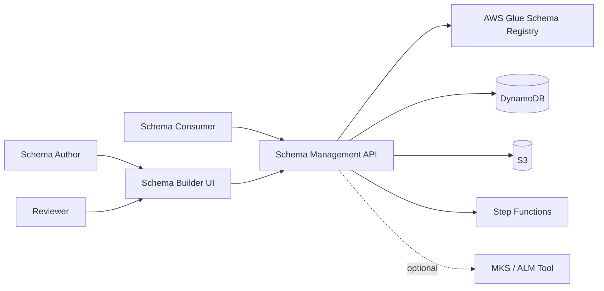
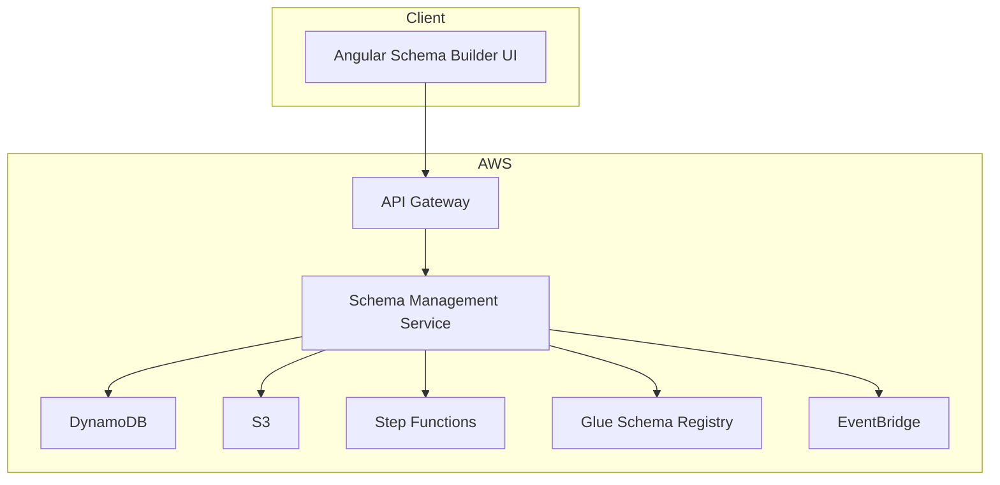
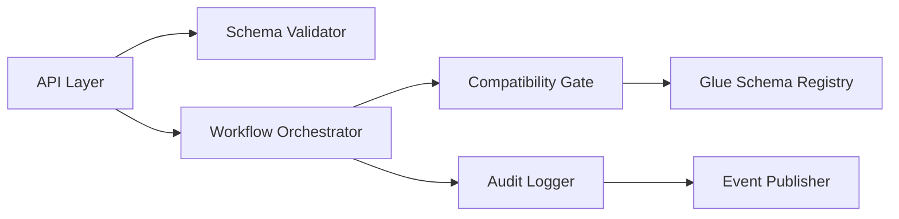
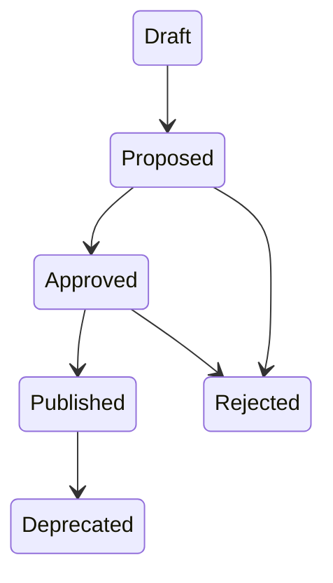
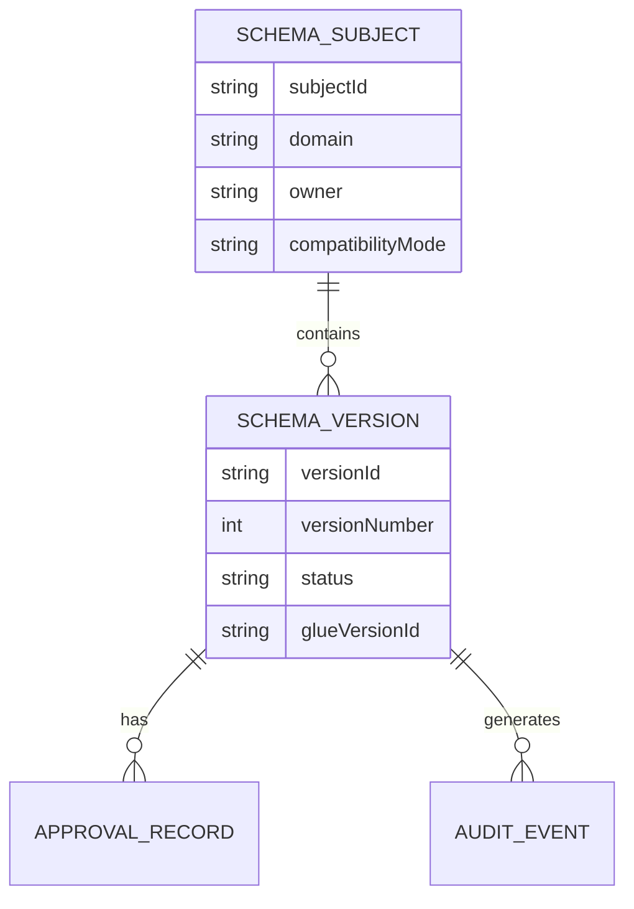

# JSON Schema Management Platform
## Systems Engineering Documentation

---

## 1. Purpose

This document defines the systems engineering design for a platform that enables:

- Guided creation of JSON Schemas
- Schema persistence and versioning
- Controlled schema evolution
- Enforcement of producer/consumer contracts
- Governed change management with auditability

The system is designed for enterprise environments and emphasizes correctness, traceability, and controlled change while remaining accessible to non-expert users.

---

## 2. System Scope

### 2.1 In Scope
- JSON Schema authoring and management
- Schema lifecycle (draft → published → deprecated)
- Schema compatibility enforcement
- Approval workflows
- Audit and traceability
- AWS-based deployment

### 2.2 Out of Scope
- Runtime data ingestion or transformation
- Automatic client SDK generation
- Non-JSON schema formats (Avro, Protobuf)

---

## 3. Stakeholders

| Role | Responsibility |
|----|----|
| Schema Author | Create and update schemas |
| Reviewer | Approve or reject schema changes |
| Consumer | Use schemas as data contracts |
| Platform Admin | Configure policies and access |
| Audit / Compliance | Review change history |

---

## 4. C4 Context View

---

## 5. C4 Container View

---

## 6. C4 Component View – Schema Management Service

---

## 7. Functional Requirements

### 7.1 Schema Authoring
- Guided creation of JSON Schemas
- Support for objects, arrays, scalars
- Reusable definitions via `$defs` / `$ref`

### 7.2 Versioning
- Immutable published versions
- Controlled creation of new versions
- Version metadata and changelogs

### 7.3 Compatibility
- Configurable compatibility modes
- Enforcement at publish time
- Rejection of incompatible changes

### 7.4 Change Management
- Draft → Review → Approval → Publish workflow
- Human approval gates
- Full audit trail

---

## 8. Schema Lifecycle

---

## 9. Data Model (Logical)

---

## 10. Validation Strategy

### 10.1 Client Side
- Continuous schema validation
- Example instance validation
- UX-friendly error feedback

### 10.2 Server Side
- Policy validation
- Lifecycle enforcement
- Compatibility enforcement via AWS Glue

---

## 11. Deployment Model

- Separate environments: Dev, Staging, Prod
- Independent Glue registries per environment
- Infrastructure defined via IaC

---

## 12. Security

- IAM-based access control
- Domain-scoped authorization
- Encryption at rest and in transit
- CloudTrail-based auditing

---

## 13. Risks and Mitigations

| Risk | Mitigation |
|----|----|
| Breaking changes | Compatibility enforcement |
| UX complexity | Guided authoring |
| Schema duplication | Reusable types |
| Approval bottlenecks | Policy-based routing |

---

## 14. Summary

This platform separates **schema governance** from **schema enforcement**:

- Governance, lifecycle, and UX are handled by the platform
- Compatibility and canonical versioning are enforced by AWS Glue

The result is a scalable, auditable, enterprise-ready schema management system.
