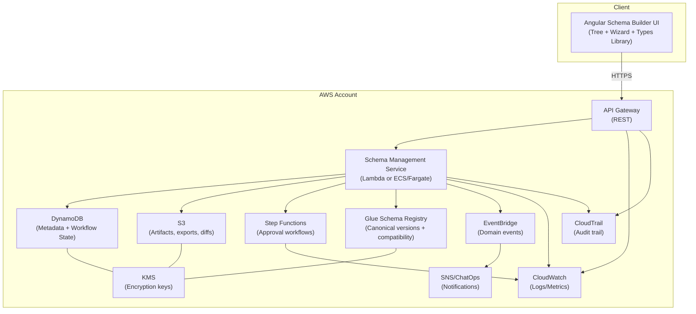
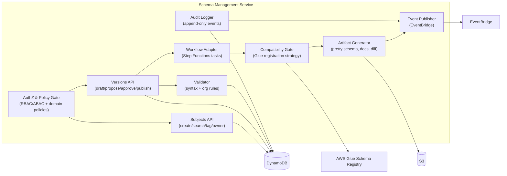
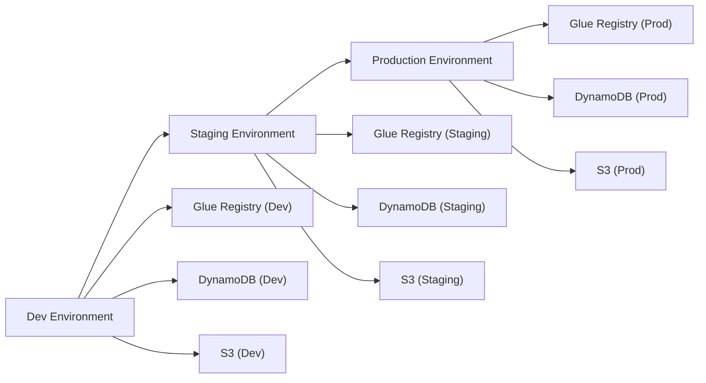
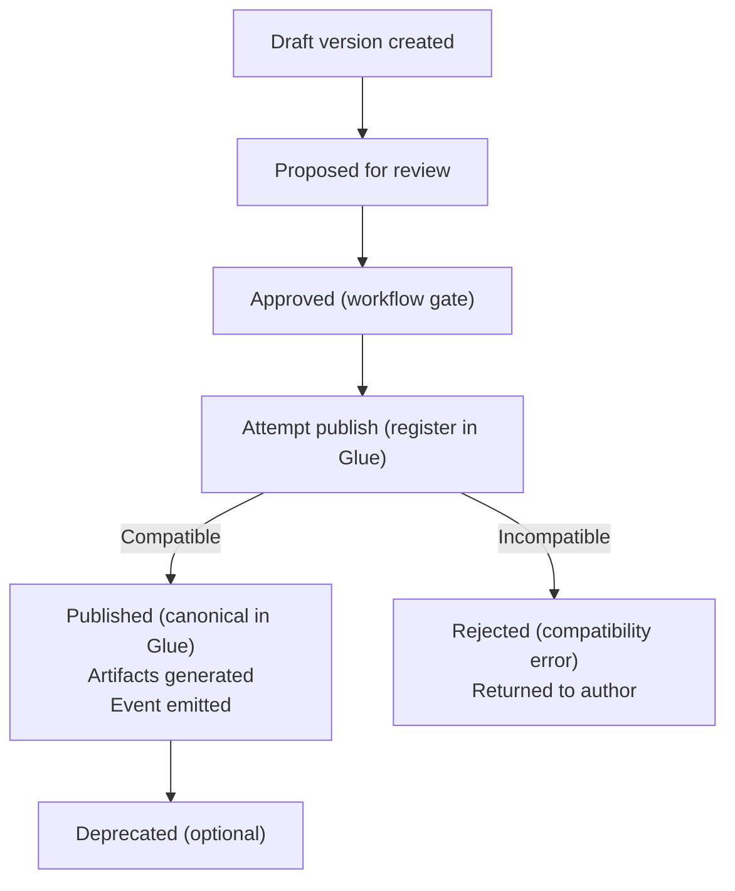
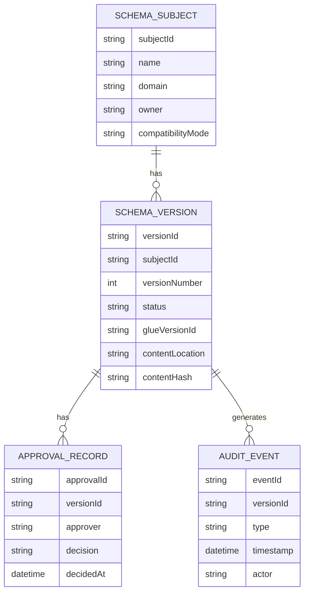
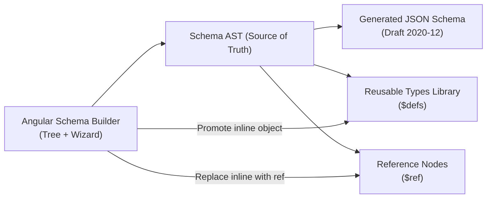

# JSON Schema Platform – C4 Diagram Pack (Mermaid)

## Purpose
This document contains a **diagram-only pack** for architecture and design reviews. It includes C4-style Context, Container, and Component views expressed as Mermaid diagrams, plus supporting deployment and data-flow diagrams.

> Intended use: copy diagrams into docs, wikis, PRDs, ADRs, or slide decks that support Mermaid rendering.

---

## 1. C4 Context View

```mermaid
flowchart LR
  %% Actors
  Author[Schema Author]
  Reviewer[Reviewer]
  Admin[Platform Admin]
  Consumer[Schema Consumer\n(API/Event Producer/Consumer)]
  Audit[Audit/Compliance]

  %% System boundary (conceptual)
  UI[Schema Builder UI\n(Angular)]
  SMS[Schema Management Platform]

  %% External systems
  Glue[AWS Glue Schema Registry]
  MKS[MKS / ALM Tool\n(Optional)]

  %% Interactions
  Author -->|Create/modify schemas| UI
  Reviewer -->|Review/approve changes| UI
  Admin -->|Configure policies & access| UI

  UI -->|Use platform APIs| SMS
  Consumer -->|Resolve schema versions\n(fetch latest/published)| SMS
  Audit -->|Review evidence| SMS

  SMS -->|Publish canonical versions\n+ enforce compatibility| Glue
  SMS -. Link change request .-> MKS
```

---

## 2. C4 Container View



---

## 3. C4 Component View – Schema Management Service



---

## 4. Deployment View (Environments and Registries)



---

## 5. Publish Data Flow (Governance → Enforcement)



---

## 6. Data Model (Logical ER)



---

## 7. UI-to-$ref Modeling Diagram (Supporting View)



---

## Notes
- These diagrams are C4-style but expressed using Mermaid flowcharts for portability.
- If your documentation tooling supports Mermaid, you can embed these diagrams directly.
