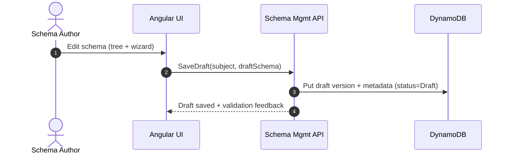
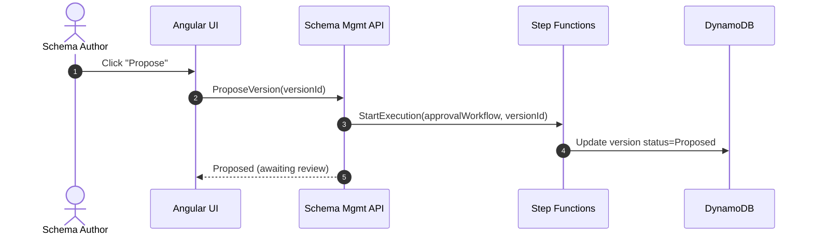
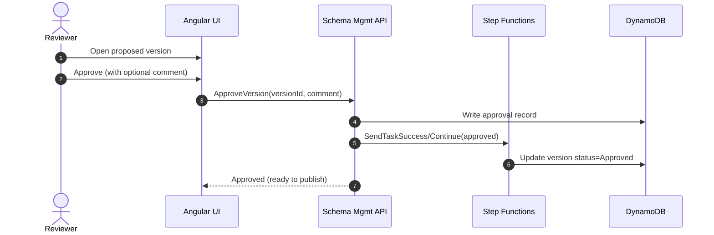
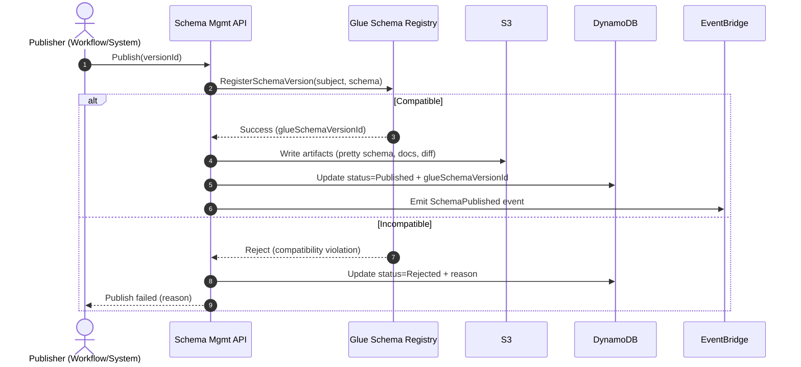
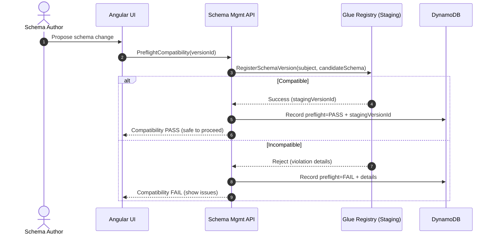
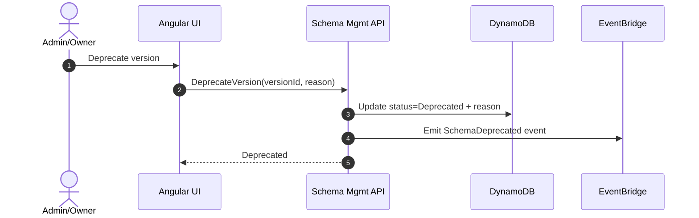
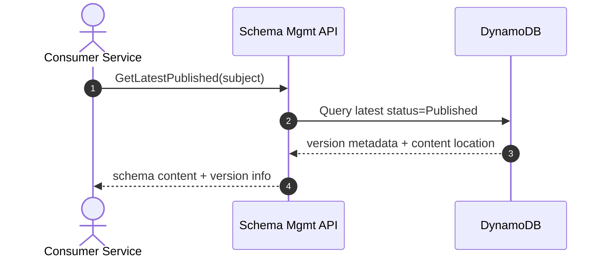
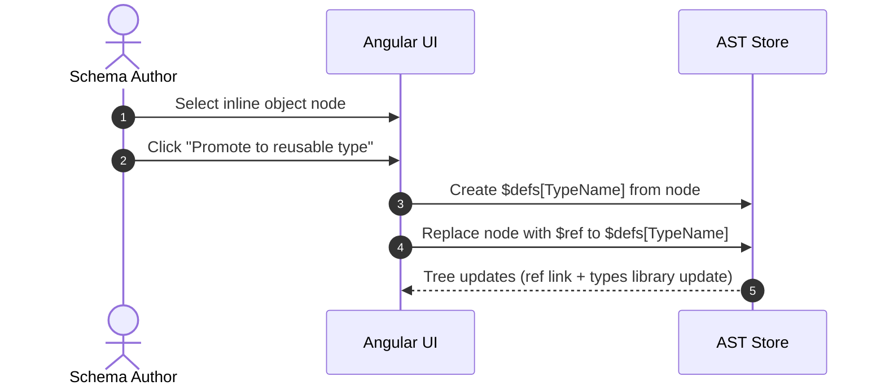
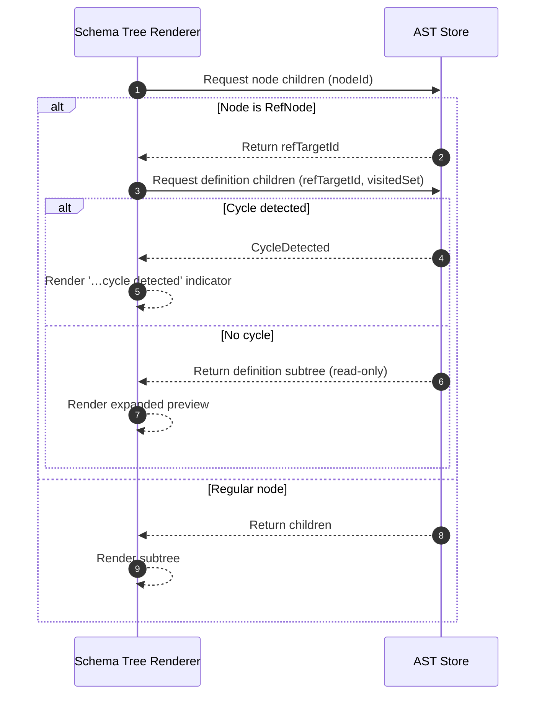
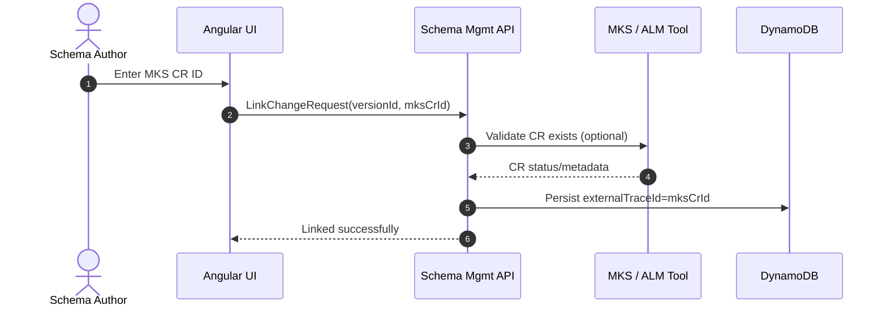

# JSON Schema Platform – Sequence Diagrams

## Purpose
This document contains **sequence diagrams only** for key platform flows. Diagrams are expressed in Mermaid for easy embedding in engineering documentation.

---

## 1. Save Draft Schema (Authoring)

---

## 2. Propose Schema for Review

---

## 3. Review and Approve

---

## 4. Publish Schema Version (Compatibility Enforcement)

---

## 5. Preflight Compatibility Check (Staging Registry Pattern)

---

## 6. Deprecate Published Version

---

## 7. Fetch Latest Published Version (Consumer)

---

## 8. Promote Inline Object → Reusable Type ($defs/$ref)

---

## 9. Resolve $ref for Display (Cycle-safe Expansion)

---

## 10. Optional: Link Schema Change to MKS Change Request

---

## Notes
- These flows assume the platform is the **governance layer** and AWS Glue is the **contract compatibility authority**.
- In staging preflight, registration is used as a compatibility check without affecting production.

